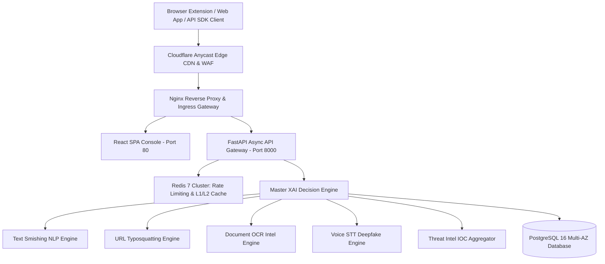

# GuardianAI — Enterprise Anti-Scam Protection & Developer Platform

[](https://github.com/guardianai/guardianai)
[](https://github.com/guardianai/guardianai)
[](https://opensource.org/licenses/MIT)
[](https://api.guardianai.io/docs)
[](https://www.python.org/)
[](https://reactjs.org/)

**GuardianAI** is a **Privacy-First, Multilingual, Explainable AI (XAI) Anti-Scam Platform** and **Public Developer Gateway**. It protects individuals, developers, and enterprise organizations against online fraud across **Text Smishing**, **Phishing URLs**, **BEC Wire Fraud**, **Digital Arrest OCR Documents**, and **Voice Deepfakes**.

---

## 🏗️ System Architecture Topology



---

## ✨ Core Platform Feature Inventory

- 🛡️ **Multi-Channel Anti-Scam Pipeline:** Sub-100ms inspection of SMS, URLs, BEC Emails, OCR Images, and Voice transcripts.
- 🔑 **Public Developer Platform & API Gateway:** Self-service API Key management (`gai_live_*`), SHA-256 key hashing, rotation, and OAuth2 SSO (Google, GitHub, Microsoft).
- ⚡ **Sub-0.1ms Tiered Rate Limiting:** Sliding-window rate limiter enforcing Free (10 RPS), Pro (100 RPS), and Enterprise (1000 RPS) quotas.
- 🧪 **Interactive REST API Playground:** Real-time endpoint selector, JSON payload editor, cURL command generator, and response viewer.
- 📊 **Developer Telemetry Analytics:** Live request volume, latency percentiles (p50/p95/p99), LLM token usage, and bandwidth tracking.
- 📦 **Polyglot SDK Client Libraries:** Native type-safe bindings for **Python** (`pip install guardianai-sdk`), **Node.js** (`npm install @guardianai/sdk`), **Go**, and **Java**.
- 🐳 **Production Infrastructure:** Multi-stage Dockerfiles ($<35\text{ MB}$ frontend, $<180\text{ MB}$ backend), Nginx reverse proxy (TLS 1.3, HSTS), PostgreSQL 16, and Redis 7.

---

## 🚀 Quick Start Installation & Local Setup

### Prerequisites
- Node.js $\ge 20.0$
- Python $\ge 3.13$
- Docker & Docker Compose

### 1. Clone Repository & Setup Virtual Environment
```bash
git clone https://github.com/guardianai/guardianai.git
cd GuardianAI

# Setup Python Backend Environment
cd backend
python -m venv venv
venv\Scripts\activate  # On Windows
pip install -r requirements.txt
```

### 2. Launch Local Development Services
```bash
# Terminal 1: Launch FastAPI Backend Server
python -m uvicorn main:app --reload --port 8000

# Terminal 2: Launch React Frontend Console
cd ../frontend
npm install
npm run dev
```
Open your browser at `http://localhost:5173/` for the React SPA Console and `http://localhost:8000/docs` for the Interactive Swagger UI.

---

## 💻 Polyglot SDK Usage Examples

### Python SDK (`pip install guardianai-sdk`):
```python
from guardianai import GuardianAIClient

client = GuardianAIClient(api_key="gai_live_88f92a110099xza21_prod")
result = client.scan_url("http://hdfc-verify.top")

print(f"Threat Score: {result.threat_score}/100")
print(f"Recommended Action: {result.recommended_action}")
```

### Node.js / TypeScript SDK (`npm install @guardianai/sdk`):
```typescript
import { GuardianAIClient } from '@guardianai/sdk';

const client = new GuardianAIClient({ apiKey: 'gai_live_88f92a110099xza21_prod' });
const result = await client.scanUrl('http://hdfc-verify.top');

console.log(`Risk Score: ${result.threat_score}`);
```

---

## 🐳 Enterprise Production Deployment

Deploy the entire production stack using Docker Compose:

```bash
docker-compose -f docker-compose.production.yml up -d --build
```

---

## 🗺️ Product Engineering Roadmap

- [x] Phase 1–13: Core AI Reasoning, NLP, Document OCR, Voice STT, Community HITL & Admin Console.
- [x] Phase 14: Developer Gateway, API Keys, OAuth SSO, Rate Limiting, Versioning, Webhooks & Playground.
- [x] Phase 15: Production Cloud Architecture, Multi-Stage Dockerfiles, Nginx TLS 1.3, CI/CD & Observability.
- [ ] Phase 16: Future GraphQL API Gateway & Edge WASM Browser Scanner.

---

## 🤝 Contributing & License

Contributions are welcome! Please review our [Contributing Guide](CONTRIBUTING.md) before submitting pull requests.

This project is licensed under the **MIT License** — see the [LICENSE](LICENSE) file for details.
