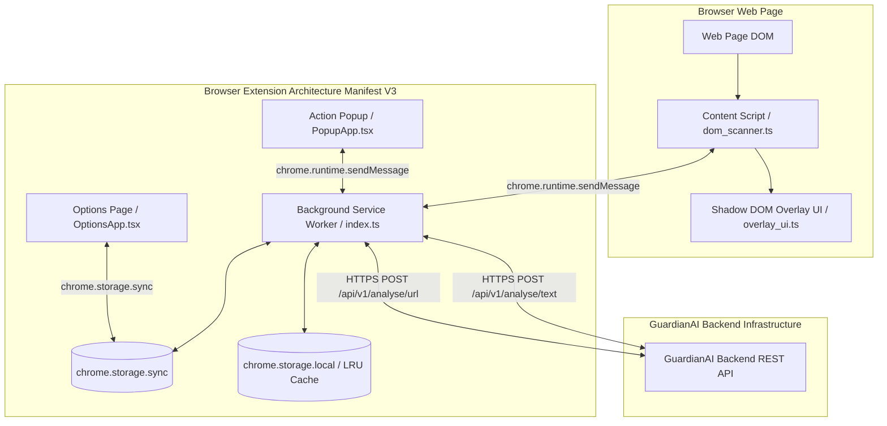
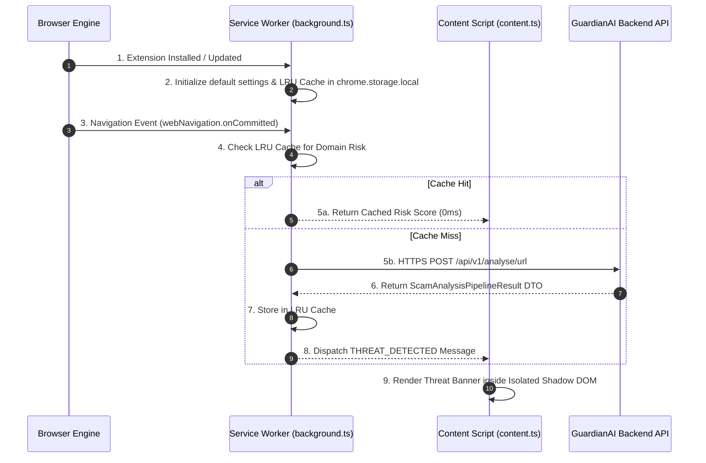

# GuardianAI Browser Protection Extension Specification
**Manifest V3 Architecture & Cybersecurity Specification**

---

## 1. System Overview & Key Architecture Principles

The **GuardianAI Browser Protection Extension** is an enterprise-grade, real-time client-side cybersecurity browser extension built on Chrome/Edge **Manifest V3**. It protects users against active web threats, phishing links, malicious UPI payment requests, credential harvesting forms, and scam text messages during live browsing sessions.

### Key Architectural Principles:
1. **Manifest V3 Service Worker Lifecycle:** Event-driven, non-persistent background execution minimizing battery and CPU footprint.
2. **Zero-Latency In-Memory Threat Cache:** Local LRU cache in `chrome.storage.local` preventing redundant network API round-trips for repeated domain / URL checks.
3. **Zero DOM Interference (Shadow DOM Isolation):** Security banners, warning tooltips, and floating action cards render inside closed **Shadow DOM containers** to prevent web page CSS leaks or website script tampering.
4. **Least-Privilege Security Model:** Declares minimal permissions (`storage`, `declarativeNetRequest`, `activeTab`, `scripting`, `alarms`) with dynamic origin host permissions requested on demand.
5. **Cross-Browser WebExtensions Compatibility:** Single codebase supporting Chrome, Microsoft Edge, and Firefox via a unified cross-browser API wrapper (`browser-polyfill.js`).

---

## 2. Folder Structure

```
browser-extension/
├── manifest.json                  # Manifest V3 configuration (Chrome / Edge / Firefox)
├── package.json                   # Build tools, TypeScript, Vite, Extension packager
├── tsconfig.json                  # TypeScript compiler settings
├── vite.config.ts                 # Vite bundle configuration for Extension build targets
├── public/
│   ├── icons/                     # GuardianAI branding icons (16px, 32px, 48px, 128px)
│   │   ├── icon-16.png
│   │   ├── icon-32.png
│   │   ├── icon-48.png
│   │   └── icon-128.png
│   └── lib/
│       └── browser-polyfill.min.js # Mozilla WebExtensions polyfill wrapper
├── src/
│   ├── background/                # Background Service Worker Module
│   │   ├── index.ts               # Master Service Worker entry point
│   │   ├── threat_listener.ts      # Web Request & Navigation listener
│   │   ├── api_client.ts          # Backend REST API client (/analyse/url, /analyse/text)
│   │   ├── cache_manager.ts       # LRU Threat Cache in chrome.storage.local
│   │   └── notification.ts        # Desktop Native Notification manager
│   ├── content/                   # Content Scripts (DOM Inspection & Warning UI)
│   │   ├── index.ts               # Content Script entry point
│   │   ├── dom_scanner.ts         # Real-time links, forms, and UPI VPA scanner
│   │   ├── overlay_ui.ts          # Shadow DOM Floating Threat Overlay Banner
│   │   └── text_highlighter.ts    # Phishing link & scam keyword highlighter
│   ├── popup/                     # Action Popup UI (React + CSS)
│   │   ├── popup.html             # Popup HTML Shell
│   │   ├── PopupApp.tsx           # React Popup Dashboard Component
│   │   ├── SeniorModeCard.tsx     # Senior Citizen Accessibility Quick Control
│   │   └── index.css              # Vanilla CSS tokens & Glassmorphism styles
│   ├── options/                   # Options / Settings Page UI
│   │   ├── options.html           # Options Page HTML Shell
│   │   ├── OptionsApp.tsx         # Options React Component
│   │   └── settings_storage.ts   # Settings sync manager (chrome.storage.sync)
│   ├── shared/                    # Shared Types, Constants & Message Bus DTOs
│   │   ├── types.ts               # Threat DTOs, ScanResult, ExtensionMessage
│   │   ├── constants.ts           # API Endpoints, Risk Thresholds, Local Storage Keys
│   │   └── messaging.ts           # Type-safe Message Bus wrappers
│   └── utils/                     # Helper Utilities
│       ├── sanitizer.ts           # DOMPurify HTML sanitizer
│       └── logger.ts              # Extension telemetry logger
```

---

## 3. High-Level Component Diagram



---

## 4. Extension Lifecycle (Manifest V3)



---

## 5. Security & Permission Model

### Content Security Policy (CSP - Manifest V3)
```json
{
  "content_security_policy": {
    "extension_pages": "script-src 'self'; object-src 'self'; script-src-elem 'self';"
  }
}
```

### Permission Strategy (Narrowest Scope Principle)
- **`declarativeNetRequest`**: Used for blocking confirmed malicious phishing domains before HTTP payload transport occurs.
- **`storage`**: Used for caching domain risk scores locally (`chrome.storage.local`) and persisting user preferences (`chrome.storage.sync`).
- **`activeTab`**: Granted strictly when the user clicks the action icon or interacts with the active tab (no global wildcard `<all_urls>` injection needed).
- **`scripting`**: Injects content scripts dynamically on suspicious link hover or navigation.
- **`alarms`**: Schedules background telemetry sync and cache eviction timers every 30 minutes.
- **Host Permissions**: Requested dynamically per tab URL via `activeTab` or explicit whitelist origins (`https://*.guardianai.io/*`).

---

## 6. Cross-Browser Compatibility (Chrome, Edge, Firefox)

To ensure seamless execution across Google Chrome, Microsoft Edge, and Mozilla Firefox:
1. **API Polyfill:** Uses `webextension-polyfill` (`browser.*`) allowing unified `async/await` syntax instead of callback-based `chrome.*` APIs.
2. **Manifest V3 Firefox Adaptation:** Supports Firefox `background.scripts` fallback if Service Worker registration differs in older Firefox ESR versions.

---

## 7. Storage Strategy & LRU Caching

```typescript
// Shared Storage Schema in chrome.storage.local
export interface CachedDomainRisk {
  domain: string;
  risk_level: 'SAFE' | 'LOW' | 'MEDIUM' | 'HIGH' | 'CRITICAL';
  risk_score: number;
  cached_at: number; // Unix epoch ms
  ttl_ms: number;    // Default 3,600,000 ms (1 hour)
}
```

- **Storage Isolation:** `chrome.storage.local` stores up to 2,000 domain risk records. Oldest records are automatically evicted when cache limits are reached.
- **Sync Preferences:** `chrome.storage.sync` syncs user settings (e.g., Senior Mode toggle, Auto-Block Phishing, Notification Sounds) across logged-in browser instances.
