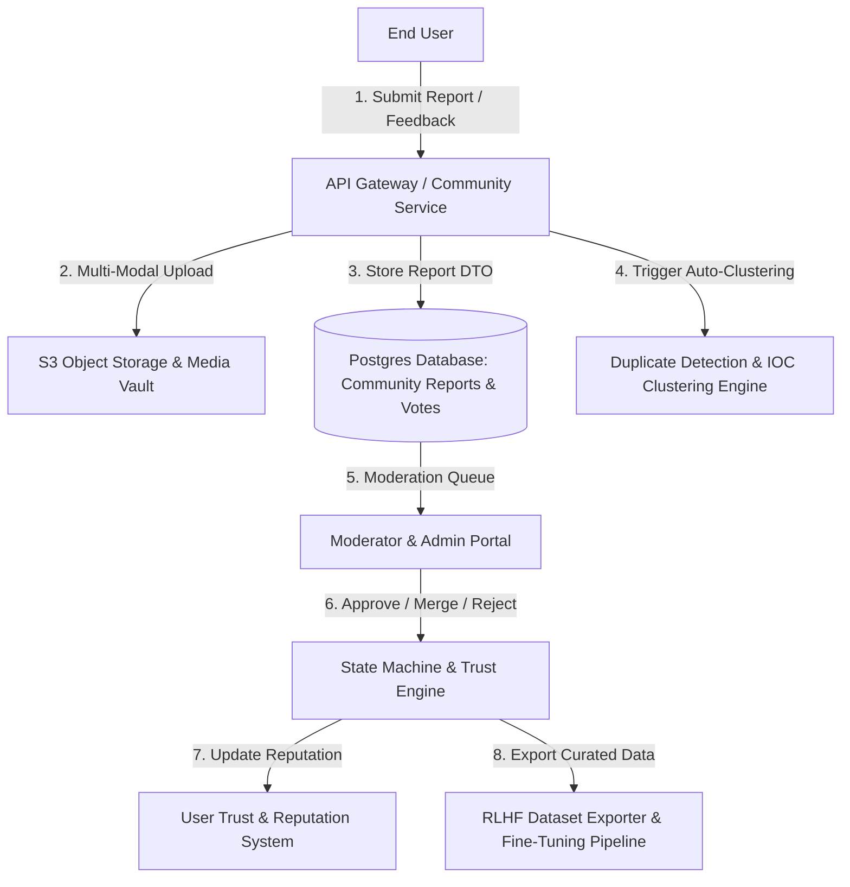
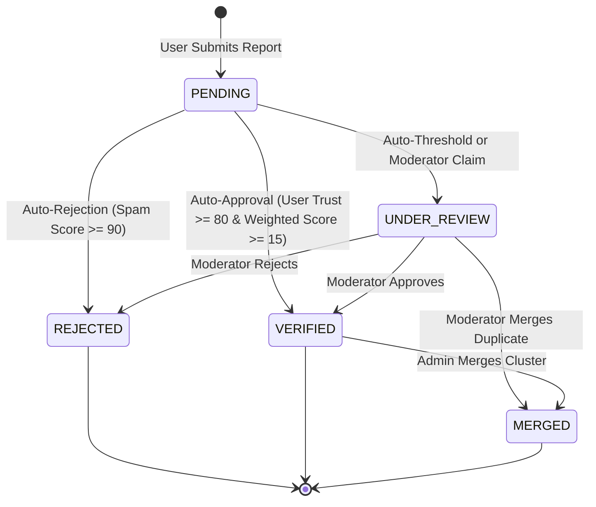

# GuardianAI Community Intelligence & Human-in-the-Loop AI Architecture Specification

> **Document Version:** 1.0.0  
> **Status:** ARCHITECTURE DESIGN & SPECIFICATION  
> **Author:** Principal AI Systems Architect & Cybersecurity Product Architect  
> **Target Subsystem:** `backend/app/community_intel/` & `frontend/src/components/community/`  

---

## 1. Executive Summary & Vision

The **Community Intelligence & Human-in-the-Loop (HITL) Subsystem** forms the crowdsourced threat verification and continuous AI feedback loop layer of GuardianAI. 

It empowers users to report emerging scams, vote on threat validity, and provide direct feedback on AI prediction accuracy (True Positives, False Positives). Moderators and administrators manage report queues, merge duplicate IOC clusters, and export curated datasets for Reinforcement Learning from Human Feedback (RLHF) and fine-tuning next-generation scam detection models.



---

## 2. System Architecture & Component Design

The subsystem is organized into 6 decoupled architectural layers adhering to Clean Architecture principles:

```
backend/app/community_intel/
├── __init__.py
├── base.py                   # Abstract Base Classes (BaseReportRepository, BaseTrustEngine)
├── schemas.py                # Pydantic v2 DTOs (ScamReportCreate, CommunityVote, FeedbackDTO)
├── exceptions.py             # Custom Domain Exceptions (CommunityIntelError, DuplicateReportError)
├── models.py                 # SQLAlchemy Database Models (ScamReport, ReportVote, TrustScoreRecord)
├── services/
│   ├── report_service.py     # Scam Report Processing & Search Service
│   ├── vote_service.py       # Weighted Voting & Feedback Service
│   ├── trust_engine.py       # Dynamic User Reputation & Trust Scoring Engine
│   ├── deduplication.py      # IOC Clustering & Similarity Matching Engine
│   └── dataset_exporter.py   # RLHF & Fine-Tuning Dataset Export Service
├── workflow.py               # State Machine Engine (PENDING -> VERIFIED / REJECTED / MERGED)
├── orchestrator.py           # Community Intelligence Master Orchestrator
└── api/
    └── v1/
        ├── reports.py        # User Endpoints (Submit, Vote, Feedback, Search)
        ├── moderation.py     # Moderator Endpoints (Approve, Reject, Merge, Flag Spam)
        └── admin.py          # Admin Endpoints (Dataset Export, Analytics, Audit Log)
```

---

## 3. Database Design & Entity-Relationship Schema

The database design utilizes PostgreSQL with JSONB columns for multi-modal attachment metadata and GIN indexes for fast IOC text searching.

```mermaid
erDiagram
    USERS ||--o{ SCAM_REPORTS : "submits"
    USERS ||--o{ REPORT_VOTES : "casts"
    USERS ||--o1 USER_TRUST_SCORES : "maintains"
    
    SCAM_REPORTS ||--o{ REPORT_VOTES : "receives"
    SCAM_REPORTS ||--o{ REPORT_ATTACHMENTS : "contains"
    SCAM_REPORTS ||--o{ AI_PREDICTION_FEEDBACK : "receives"
    
    SCAM_REPORTS {
        uuid id PK
        string user_id FK
        string scam_category
        string status "PENDING | UNDER_REVIEW | VERIFIED | REJECTED | MERGED"
        string target_persona
        string title
        text description
        string ioc_hash
        jsonb iocs_extracted
        integer upvote_count
        integer downvote_count
        float weighted_score
        boolean is_spam
        datetime created_at
        datetime updated_at
    }

    AI_PREDICTION_FEEDBACK {
        uuid id PK
        uuid report_id FK
        string user_id FK
        string predicted_risk_level
        string actual_risk_level
        boolean is_correct "True Positive / False Positive"
        text correction_reason
        datetime created_at
    }

    USER_TRUST_SCORES {
        uuid id PK
        string user_id FK
        integer trust_score "0 to 100"
        string trust_tier "NOVICE | TRUSTED | EXPERT | MODERATOR"
        integer verified_reports_count
        integer rejected_reports_count
        integer spam_strikes_count
        datetime updated_at
    }
```

---

## 4. Moderation Workflow & State Machine

Every report transitions through a strict State Machine with role-based access control (RBAC):



---

## 5. Trust & Reputation Scoring Engine ($T_u$)

User reputation dynamically adjusts based on report verification outcome:

$$\Delta T_u = \begin{cases} 
+5 & \text{if Report Verified by Moderator} \\
-10 & \text{if Report Rejected as Unsubstantiated} \\
-30 & \text{if Flagged as Intentional Spam} \\
+1 & \text{if Vote Aligns with Final Moderator Decision}
\end{cases}$$

### Weighted Vote Impact ($W_v$)
A vote cast by a user is weighted by their trust tier:

$$W_v = \text{Vote Direction} \times \left(1 + \frac{T_u}{100}\right)$$

---

## 6. RLHF & Fine-Tuning Dataset Export Architecture

Administrators can export curated datasets formatted in standard JSONL structure for direct fine-tuning of Gemini / open LLM models:

```json
{
  "instruction": "Analyze the following message for scam indicator vectors:",
  "input": "Dear customer your HDFC bank account is blocked. Update KYC immediately at http://hdfc-verify.top",
  "predicted_label": "SAFE",
  "corrected_label": "DANGEROUS",
  "feedback_type": "FALSE_NEGATIVE",
  "verified_by_moderator": true,
  "confidence": 0.98,
  "metadata": {
    "scam_category": "BANKING_FRAUD",
    "iocs": ["http://hdfc-verify.top"],
    "target_persona": "SENIOR_CITIZENS"
  }
}
```

---

## 7. Verification & Implementation Roadmap

1. **Phase 12.1**: Database Schema & Pydantic Models (`models.py`, `schemas.py`)
2. **Phase 12.2**: Report Submission & Multi-Modal Upload Service (`report_service.py`)
3. **Phase 12.3**: Voting & AI Prediction Feedback Engine (`vote_service.py`)
4. **Phase 12.4**: User Reputation & Trust Scoring Engine (`trust_engine.py`)
5. **Phase 12.5**: Deduplication & IOC Clustering Engine (`deduplication.py`)
6. **Phase 12.6**: Moderator & Admin REST API Controllers (`moderation.py`, `admin.py`)
7. **Phase 12.7**: RLHF Dataset Exporter (`dataset_exporter.py`)
8. **Phase 12.8**: Frontend Community Hub UI Component (`frontend/src/components/community/`)
