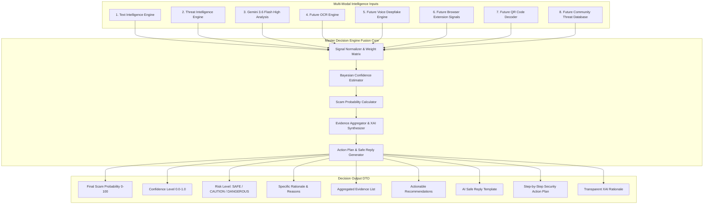

# GuardianAI Master Decision Engine Architecture Specification

**Document Version:** 1.0.0  
**Architects:** Principal AI Architect & Principal Cybersecurity Engineer  
**Target Module:** Master Decision Engine (`app/decision_engine/`)  
**Date:** July 2026  
**Status:** **APPROVED ARCHITECTURAL SPECIFICATION**  

---

## 1. Executive Summary & Core Mission

The **GuardianAI Master Decision Engine** is the core multi-modal fusion orchestrator of the GuardianAI platform. It synthesizes intelligence signals from **Text Intelligence, Threat Intelligence, Gemini AI Analysis**, and future modalities (**OCR, Voice Deepfake Analysis, Browser Extension Signals, QR Decoding, Community Crowdsourced Reports**) into a unified, actionable, and explainable threat verdict.

---

## 2. System Architecture & Multi-Modal Fusion Pipeline



---

## 3. Modular Folder Structure Layout (`backend/app/decision_engine/`)

```
backend/app/decision_engine/
├── __init__.py                # Package exports
├── schemas.py                 # Decision Engine Input/Output Pydantic DTOs
├── normalizer.py              # Multi-modal input signal normalizer
├── confidence.py              # Bayesian confidence estimation engine
├── scoring_fusion.py          # Multi-modal weighted fusion scoring algorithm
├── evidence_aggregator.py     # Unified evidence collector & XAI builder
├── action_planner.py          # Action plan & safe reply template generator
├── pipeline.py                # Master Decision Engine Pipeline Orchestrator
└── adapters/                  # Future Modality Adapters
    ├── ocr_adapter.py         # Future OCR Text Signal Adapter
    ├── voice_adapter.py       # Future Voice Deepfake Adapter
    ├── browser_adapter.py     # Future Browser Extension Signal Adapter
    ├── qr_adapter.py          # Future QR Code Adapter
    └── community_adapter.py   # Future Crowdsourced Threat Database Adapter
```

---

## 4. Multi-Modal Fusion Data Flow

1. **Signal Ingestion:** Accepts structured reports from Text Intelligence, Threat Intelligence, and Gemini LLM.
2. **Signal Normalization (`normalizer.py`):** Normalizes heterogeneous risk scores (0-100 scale) and flags onto standardized weight matrices.
3. **Confidence Estimation (`confidence.py`):** Computes Bayesian statistical confidence based on cross-modal signal agreement.
4. **Scam Probability Calculation (`scoring_fusion.py`):** Combines weighted threat signals:

$$\text{Final Scam Probability} = \min\left(100, \sum (w_i \cdot S_i) + \Delta_{\text{psychological}}\right)$$

5. **Evidence & XAI Synthesis (`evidence_aggregator.py`):** Combines technical IOC evidence with psychological manipulation evidence.
6. **Action Plan & Safe Reply Generation (`action_planner.py`):** Generates emergency user action steps and safe decline reply templates.

---

## 5. Decision Engine Output Schema DTO

```json
{
  "scan_id": "scn_decision_1001",
  "final_scam_probability": 94,
  "confidence": 0.98,
  "risk_level": "DANGEROUS",
  "reasons": [
    "High urgency smishing attempt mimicking PayPal.",
    "Domain paypa1-check.top uses typosquatting to spoof brand.",
    "UPI handle support.refund@okaxis impersonates customer desk."
  ],
  "evidence": [
    {
      "indicator": "paypa1-check.top",
      "category": "DOMAIN",
      "reason": "Typosquatting domain link mimicking PayPal",
      "severity": "Critical",
      "source": "DOMAIN_INTELLIGENCE"
    }
  ],
  "recommendations": [
    "Do NOT click any links in the message.",
    "Never send money or share OTP codes."
  ],
  "safe_reply": "I have reported this unauthorized message to official security channels. Do not contact me again.",
  "action_plan": [
    "Step 1: Block sender phone number immediately.",
    "Step 2: Log into your official banking app independently to verify account status.",
    "Step 3: Report smishing attempt to national cybercrime portal."
  ],
  "explainability": {
    "summary": "Critical danger smishing attempt. Combines spoofed domain links and fake account lock warnings to steal funds.",
    "psychological_factors_detected": ["URGENCY", "FEAR", "IMPERSONATION", "TRUST"]
  }
}
```

---

## 6. Confidence Scoring Strategy

The Decision Engine uses a **Cross-Modal Signal Agreement Matrix**:
- **High Confidence (0.90 - 0.99):** Multi-modal agreement (e.g. Technical IOC domain typosquatting + LLM detecting Urgency & Impersonation).
- **Medium Confidence (0.75 - 0.89):** Single strong signal detected (e.g. Confirmed typosquatting link with neutral LLM text).
- **Low Confidence (0.50 - 0.74):** Weak or conflicting signals (e.g. Unverified new link without threat markers).

---

## 7. Future Extensibility Hooks

The adapter directory (`app/decision_engine/adapters/`) exposes pluggable abstract interfaces (`BaseModalityAdapter`), allowing seamless addition of **OCR, Voice Deepfake, Browser Extension, QR Decoding, and Community Reports** without modifying core decision logic.
