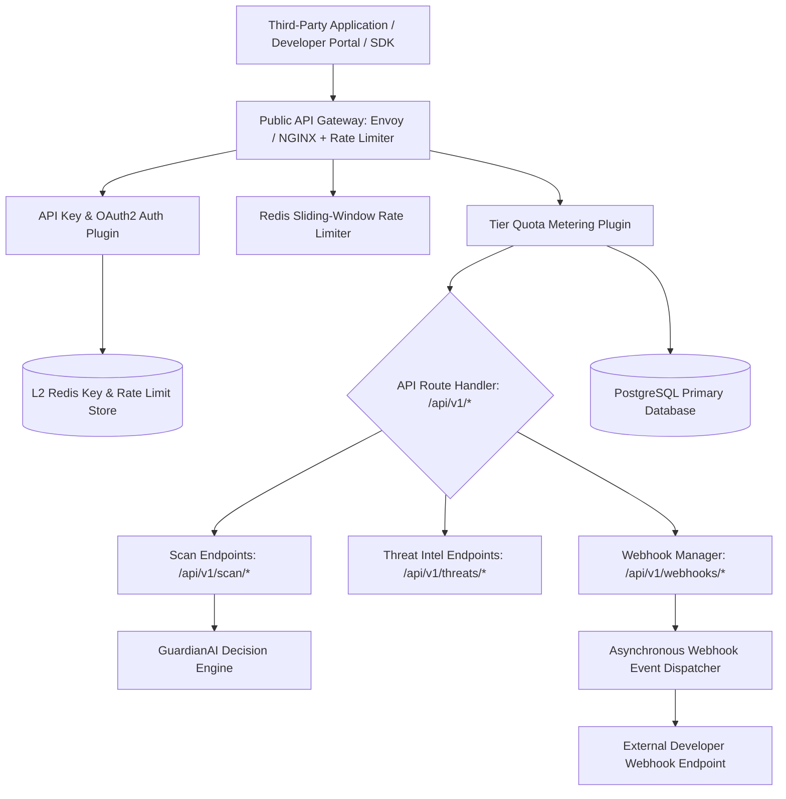
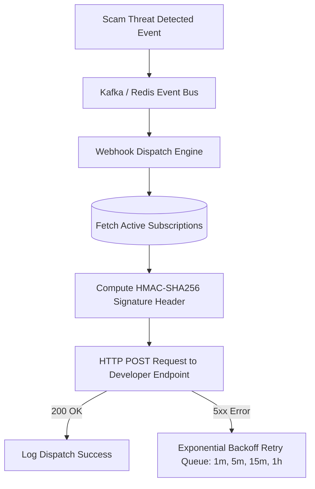

# GuardianAI Developer Platform & Public API Gateway Architecture Specification

**Document Version:** 1.0.0  
**Date:** August 01, 2026  
**Status:** ARCHITECTURAL SPECIFICATION & DESIGN  
**Author:** Principal API Platform Architect  

---

## Executive Summary

The **GuardianAI Developer Platform** empowers enterprise security teams, third-party software vendors, financial institutions, and developers to seamlessly integrate GuardianAI's explainable anti-scam intelligence into their applications.

The platform provides a high-throughput, low-latency API Gateway supporting API Key & OAuth2 Client Credentials authentication, Redis sliding-window rate limiting, tier quota enforcement, real-time usage analytics, webhook event dispatching, and SDK clients (Python & TypeScript).

---

## 1. System Topology & API Gateway Architecture



---

## 2. API Key Architecture & Security Strategy

### API Key Prefixing & Format:
- **Production Key:** `gai_live_` + 32-character cryptographically secure random string (e.g. `gai_live_88f92a110099xza21_prod`)
- **Test / Sandbox Key:** `gai_test_` + 32-character random string (e.g. `gai_test_44e11b882200abc12_test`)

### Cryptographic Storage Strategy:
Raw API keys are displayed **only once** upon generation. The database stores only the **SHA-256 hash** of the key.

```sql
CREATE TABLE api_keys (
    id VARCHAR(36) PRIMARY KEY,
    user_id VARCHAR(36) NOT NULL REFERENCES users(id),
    name VARCHAR(128) NOT NULL,
    key_prefix VARCHAR(12) NOT NULL, -- e.g. "gai_live_88f9"
    key_hash VARCHAR(64) NOT NULL UNIQUE, -- SHA-256 hash
    environment VARCHAR(16) NOT NULL DEFAULT 'LIVE', -- LIVE, TEST
    tier VARCHAR(16) NOT NULL DEFAULT 'FREE', -- FREE, PRO, ENTERPRISE
    scopes JSONB NOT NULL DEFAULT '["scan:read", "scan:write"]',
    rate_limit_rps INT NOT NULL DEFAULT 10,
    daily_quota INT NOT NULL DEFAULT 1000,
    is_active BOOLEAN NOT NULL DEFAULT TRUE,
    expires_at TIMESTAMP WITH TIME ZONE NULL,
    created_at TIMESTAMP WITH TIME ZONE DEFAULT CURRENT_TIMESTAMP
);
```

---

## 3. Tier Quotas & Rate Limiting SLA Matrix

| Tier | RPS Limit (Sliding Window) | Daily Quota | Webhook Retries | Price Tier |
| :--- | :--- | :--- | :--- | :--- |
| **Free Developer** | 10 RPS | 1,000 requests/day | 3 retries (Exponential backoff) | $0 / month |
| **Pro Business** | 100 RPS | 50,000 requests/day | 5 retries | $299 / month |
| **Enterprise SLA** | 1,000 RPS | 1,000,000 requests/day | 10 retries + Dedicated IP | Custom SLA |

---

## 4. Webhook Framework Architecture & Signature Verification



### Signature Verification Header (`X-GuardianAI-Signature`):
```python
import hmac
import hashlib

def verify_webhook_signature(payload_bytes: bytes, secret: str, received_signature: str) -> bool:
    expected_signature = hmac.new(secret.encode('utf-8'), payload_bytes, hashlib.sha256).hexdigest()
    return hmac.compare_digest(expected_signature, received_signature)
```

---

## 5. Directory Structure

```
backend/
├── app/
│   ├── developer_platform/
│   │   ├── __init__.py
│   │   ├── api_key_service.py       # API Key Generation & SHA-256 Hashing Engine
│   │   ├── rate_limiter.py          # Redis Sliding Window Rate Limiter
│   │   ├── webhook_dispatcher.py    # HMAC-SHA256 Webhook Event Dispatcher
│   │   ├── quota_meter.py           # Daily Usage Quota Manager
│   │   └── schemas/
│   │       ├── api_key.py
│   │       └── webhook.py
frontend/
├── src/
│   ├── pages/
│   │   ├── developer/
│   │   │   ├── DeveloperPortalPage.tsx    # API Keys & Webhook Console
│   │   │   ├── APIDocumentationPage.tsx   # Interactive OpenAPI Docs & Code Generator
│   │   │   └── APIAnalyticsPage.tsx       # Developer Usage & Latency Telemetry
```

---

## 6. Future GraphQL & Versioning Strategy

1. **Path Versioning:** `/api/v1/*` (Current Stable) and `/api/v2/*` (Future Major Release).
2. **Deprecation Header Policy:** API endpoints scheduled for sunset emit `X-API-Deprecation-Date: 2027-01-01` headers.
3. **GraphQL Readiness:** Architecture supports mounting a Strawberry GraphQL endpoint (`/graphql`) sharing the same core `APIKeyAuthMiddleware` and `RateLimiter` dependencies.
