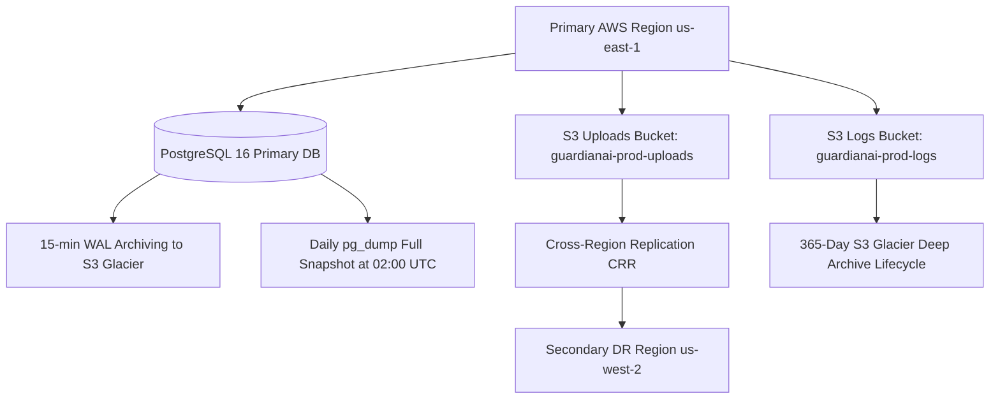

# GuardianAI Enterprise Backup & Disaster Recovery (DR) Plan

**Document Version:** 1.0.0  
**Date:** August 01, 2026  
**Status:** ENTERPRISE PRODUCTION DR SPECIFICATION  
**Author:** Principal Infrastructure & Reliability Engineer  

---

## Executive Summary

The **GuardianAI Disaster Recovery Strategy** guarantees **RPO $< 15$ minutes** and **RTO $< 1$ hour** across all primary system components (Database, File Uploads, Structured Logs, and System Configurations).

---

## 1. Backup & Recovery Topology

---

## 2. Backup Target Matrix & RPO/RTO SLA

| Backup Target | Backup Strategy & Mechanism | Frequency | Storage Location | RPO SLA | RTO SLA |
| :--- | :--- | :--- | :--- | :--- | :--- |
| **PostgreSQL Database** | WAL Archiving & Daily `pg_dump` Snapshot | 15-min WAL / Daily Dump | AWS S3 Glacier (AES-256) | $< 15\text{ mins}$ | $< 1\text{ hour}$ |
| **User File Uploads** | S3 Bucket Versioning & Cross-Region Replication | Real-time S3 CRR | Secondary AWS Region S3 | $< 1\text{ min}$ | $< 15\text{ mins}$ |
| **Structured JSON Logs** | Vector / Logstash Shipping to S3 Glacier | Hourly Batch | AWS S3 Glacier (365-day) | $< 1\text{ hour}$ | $< 4\text{ hours}$ |
| **System Configurations** | Infrastructure-as-Code Git Repo & K8s Manifests | On Every Git Push | GitHub Enterprise Repo | $< 0\text{ mins}$ | $< 30\text{ mins}$ |

---

## 3. Disaster Recovery Failover Procedure (RTO $< 1$ Hour)

1. **Detection:** Route53 Health Probe fails 3 consecutive pings to `us-east-1`.
2. **DNS Switch:** Route53 Latency Alias DNS updates `api.guardianai.io` to point to `us-west-2`.
3. **Database Promotion:** Secondary PostgreSQL Read Replica promoted to Primary DB.
4. **Service Verification:** Automated smoke tests evaluate `GET /api/v1/health`.
