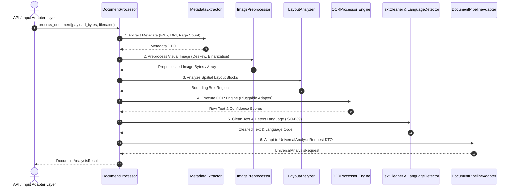

# GuardianAI Document Intelligence Module Architecture & Specification

**Document ID:** `docs/DOCUMENT_INTELLIGENCE_ARCHITECTURE.md`  
**Role:** Principal Computer Vision Architect & AI Systems Engineer  
**System Name:** GuardianAI Document Intelligence Engine (`app/document_intel`)  
**Status:** **APPROVED ARCHITECTURAL DESIGN**  

---

## 1. System Overview & Vision

The **Document Intelligence Module** is GuardianAI's computer vision and visual document analysis engine. It processes unstructured visual inputs—such as smartphone screenshots of bank scams, phishing emails rendered as images, scanned multi-page PDF notices, and fake government letters—converting them into structured text streams and rich layout spatial metadata for downstream scam detection.

### Supported Input Modalities
- **Image Screenshots:** PNG, JPEG, WEBP, GIF (Desktop & Mobile viewports)
- **PDF Documents:** Digital vector PDFs & Scanned raster PDFs
- **Scanned Paper Notices:** High-resolution physical document scans
- **Future Camera Capture:** Live video stream frame capture (iOS/Android camera)
- **Future Browser Screenshots:** Automated DOM page viewport renders (Chrome extension / headless browser)

---

## 2. Component Separation of Concerns

```
backend/app/document_intel/
├── __init__.py
├── base.py                   # Abstract Base Document Processor & OCR Engine Contracts
├── schemas.py                # Pydantic v2 DTOs (DocumentAnalysisResult, LayoutBlock, BoundingBox)
├── preprocessor.py           # ImagePreprocessor (Grayscale, Deskew, Noise Reduction, Rescaling)
├── ocr_processor.py          # OCRProcessor (Engine Dispatcher & Abstract Provider Adapter)
├── layout_analyzer.py        # LayoutAnalyzer (Block Segmentation, Text Region Box Detection)
├── metadata_extractor.py     # MetadataExtractor (EXIF, DPI, Page Count, Image Attributes)
├── text_cleaner.py           # TextCleaner (OCR Artifact Removal, Line Joining, Special Chars)
├── language_detector.py      # LanguageDetector (Script & ISO-639 Code Identifier)
├── pipeline_adapter.py       # PipelineAdapter (Converts Document DTO to UniversalAnalysisRequest)
├── exceptions.py             # Custom Document Intelligence Exception Hierarchy
└── orchestrator.py           # DocumentProcessor (Master Orchestrator Engine)
```

---

## 3. Component Responsibilities Matrix

| Component | Class Name | Technical Responsibilities |
| :--- | :--- | :--- |
| **1. Master Orchestrator** | `DocumentProcessor` | Coordinates pre-processing, metadata extraction, layout analysis, OCR engine execution, text cleaning, and language detection |
| **2. Image Preprocessor** | `ImagePreprocessor` | Computer vision pipeline: Grayscale conversion, contrast stretching, Otsu binarization, noise reduction, deskewing angle correction, and DPI scaling |
| **3. Layout Analyzer** | `LayoutAnalyzer` | Spatial document layout segmentation, detecting text bounding boxes (`xmin, ymin, xmax, ymax`), reading order sorting, and header/body block classification |
| **4. OCR Engine Dispatcher** | `OCRProcessor` | Pluggable OCR interface supporting Tesseract, EasyOCR, PaddleOCR, and Cloud Vision providers with fallback mechanics |
| **5. Metadata Extractor** | `MetadataExtractor` | Extracts file format signatures, EXIF orientation metadata, image dimensions, color channel depth, and PDF page counts |
| **6. Text Cleaner** | `TextCleaner` | Cleans raw OCR output: repairs broken line breaks, removes character noise, fixes common OCR homoglyph confusions (e.g. `0` vs `O`, `1` vs `l`) |
| **7. Language Detector** | `LanguageDetector` | Identifies script types (Latin, Devanagari, Cyrillic) and resolves ISO-639 language codes (`en`, `hi`, `es`, `fr`, `de`) |
| **8. Pipeline Adapter** | `DocumentPipelineAdapter` | Transforms `DocumentAnalysisResult` into standard `UniversalAnalysisRequest` DTO for `ScamAnalysisPipeline` consumption |

---

## 4. Sequence Diagram



---

## 5. Dependency Injection Architecture

`DocumentProcessor` relies on abstract interfaces for OCR providers and preprocessors to enable zero-downtime provider switching:

```python
class DocumentProcessor:
    def __init__(
        self,
        ocr_provider: BaseOCREngine = ProviderFactory.get_default_ocr(),
        preprocessor: BaseImagePreprocessor = DefaultPreprocessor(),
        layout_analyzer: BaseLayoutAnalyzer = DefaultLayoutAnalyzer()
    ):
        self.ocr_provider = ocr_provider
        self.preprocessor = preprocessor
        self.layout_analyzer = layout_analyzer
```

---

## 6. Performance & Latency SLA Strategy

- **Preprocessing Sub-30ms SLA:** Computer vision operations (rescaling, Otsu thresholding) operate using optimized NumPy / OpenCV array operations.
- **Concurrent Page Processing:** Multi-page PDF documents are processed concurrently via `asyncio.gather` bounded by `Semaphore(max_concurrency=5)`.
- **Bounding Box Caching:** Layout bounding boxes are cached alongside SHA-256 image hashes to avoid redundant OCR scans on duplicate images.
- **Target SLA Threshold:** < 200ms per standard single-page document screenshot.

---

## 7. Multilingual OCR Extension Strategy

The engine supports multi-script OCR through language pack dispatching:
- **Latin Script (English, Spanish, French, German):** Fast Tesseract / EasyOCR Latin model.
- **Indic Script (Hindi, Marathi, Tamil, Telugu):** EasyOCR Indic model or Google Cloud Vision API.
- **Auto Script Detection:** `LanguageDetector` inspects initial character Unicode ranges and dynamically loads appropriate language dictionaries into `OCRProcessor`.
