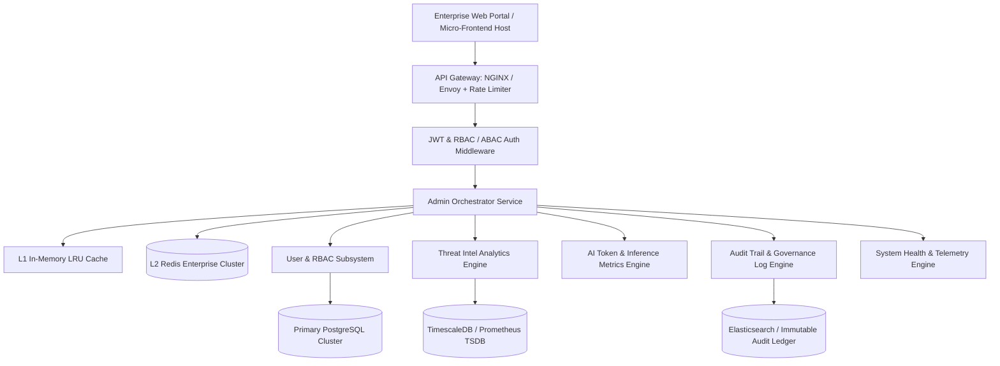
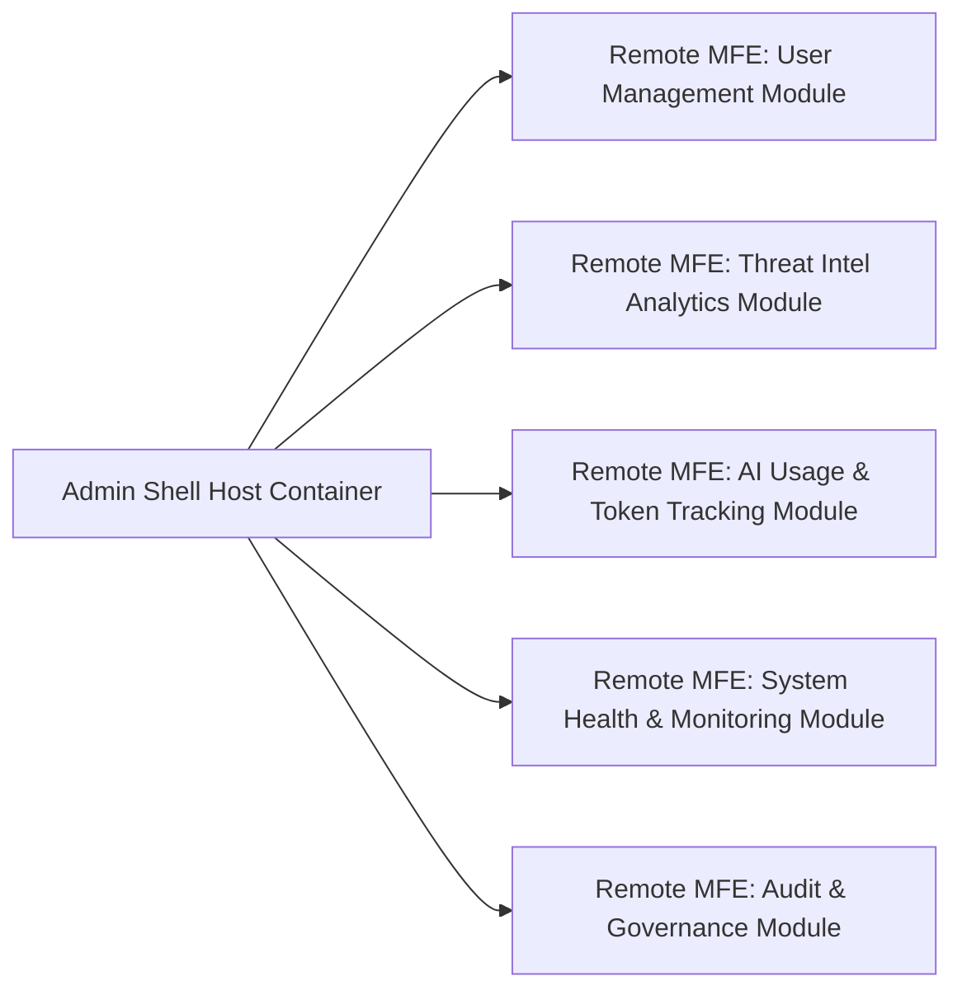
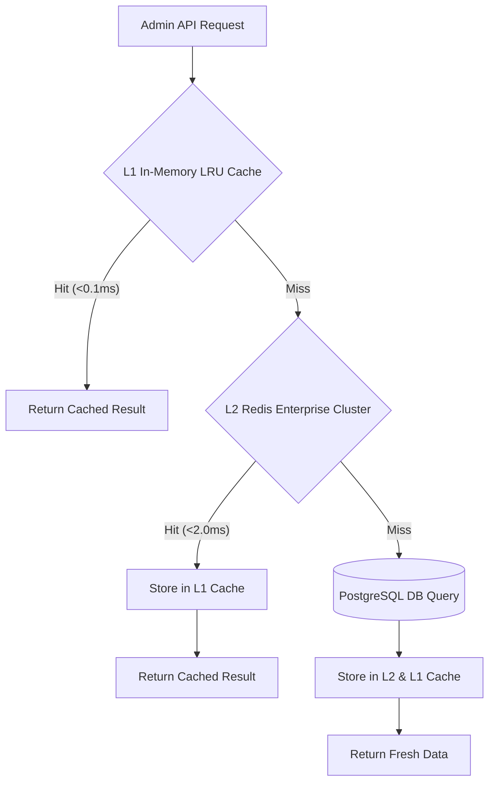

# GuardianAI Enterprise Admin Platform Architecture Specification

**Document Version:** 1.0.0  
**Date:** August 01, 2026  
**Status:** ARCHITECTURAL SPECIFICATION & DESIGN  
**Author:** Principal Enterprise Software Architect  

---

## Executive Summary

The **GuardianAI Enterprise Admin Platform** provides a secure, high-throughput, micro-frontend-ready management console for platform administrators, security operations center (SOC) analysts, community moderators, compliance officers, and AI engineers.

The platform unifies 10 specialized command dashboards into a single glassmorphism enterprise web application, supported by Role-Based Access Control (RBAC), Attribute-Based Access Control (ABAC), multi-tier LRU memory and Redis caching, asynchronous WebSocket telemetry, and fine-grained audit logging.

---

## 1. System Topology & Micro-Frontend Architecture



---

## 2. Micro-Frontend Module Federation Design

The Enterprise Admin Platform utilizes Vite / Webpack 5 **Module Federation** to decouple dashboard teams, enabling independent deployment of dashboard modules without rebuilding the core shell.



### Module Federation Configuration Example (`vite.config.ts`):
```typescript
import { defineConfig } from 'vite';
import federation from '@originjs/vite-plugin-federation';

export default defineConfig({
  plugins: [
    federation({
      name: 'guardian_admin_shell',
      remotes: {
        userManagementMfe: 'http://localhost:5001/assets/remoteEntry.js',
        threatIntelMfe: 'http://localhost:5002/assets/remoteEntry.js',
        aiMetricsMfe: 'http://localhost:5003/assets/remoteEntry.js',
      },
      shared: ['react', 'react-dom', 'react-router-dom', '@tanstack/react-query'],
    }),
  ],
});
```

---

## 3. The 10 Enterprise Admin Dashboards

### 1. Master Command Center Dashboard (`/admin/dashboard`)
- **Key Metrics:** Real-time threat detection count, active security scans, active user sessions, global API latency, system health status indicator.
- **Widgets:** Incident ticker, geographic threat map, real-time threat detection gauge.

### 2. Analytics Dashboard (`/admin/analytics`)
- **Key Metrics:** Scams blocked over time, channel breakdown (Message, Email, URL, QR, Voice), user retention, false positive ratios.
- **Widgets:** Interactive Chart.js / Recharts time-series line graphs, heatmaps.

### 3. User & Role Management Dashboard (`/admin/users`)
- **Key Metrics:** Total registered accounts, active sessions, MFA enforcement rate, suspended accounts.
- **Capabilities:** Create user, assign RBAC roles (`SUPER_ADMIN`, `SOC_ANALYST`, `MODERATOR`, `AUDITOR`), enforce password resets, revoke JWT tokens.

### 4. Threat Intelligence Dashboard (`/admin/threat-intel`)
- **Key Metrics:** Total active IOCs (URLs, Phone Numbers, UPI Handles, Domains), risk score distributions, domain reputation lookups.
- **Capabilities:** Add IOC to global blocklist, export STIX / TAXII threat feeds, domain WHOIS & DNS analytics.

### 5. AI Usage & Token Consumption Dashboard (`/admin/ai-usage`)
- **Key Metrics:** Total LLM inference tokens consumed (Gemini / Claude / OpenLLM), average latency per prompt, inference cost breakdown, fallback rate.
- **Capabilities:** Set model rate limits, adjust temperature / top_p hyper-parameters, monitor token quotas.

### 6. API Management & Developer Key Dashboard (`/admin/api-keys`)
- **Key Metrics:** Active API keys, requests per second (RPS), HTTP 4xx / 5xx error rates, rate limit triggers.
- **Capabilities:** Generate enterprise API keys, set tier quotas (Free: 1,000/day, Enterprise: 1,000,000/day), revoke compromised keys.

### 7. Audit Trail & Governance Dashboard (`/admin/audit-logs`)
- **Key Metrics:** Total administrative actions logged, IP origin distribution, compliance violation flags.
- **Capabilities:** Full-text search across immutable audit logs, filter by user / action / date, export CSV / JSON audit reports for ISO 27001 compliance.

### 8. Moderation Control Dashboard (`/admin/moderation`)
- **Key Metrics:** Pending scam reports queue length, average moderation resolution time, moderator accuracy ratings.
- **Capabilities:** Approve reports, reject unsubstantiated claims, flag spam, merge duplicate IOCs, adjust user reputation scores.

### 9. System Health & Infrastructure Monitoring (`/admin/system-health`)
- **Key Metrics:** CPU / Memory / Disk usage, PostgreSQL connection pool depth, Redis cache hit ratio, Uvicorn worker thread latencies.
- **Capabilities:** Health check probes, service restart triggers, automated alert webhook routing.

### 10. Notification & Alert Broadcast Dashboard (`/admin/notifications`)
- **Key Metrics:** Sent notifications count, email delivery rates, active system broadcast banners.
- **Capabilities:** Dispatch emergency security broadcast announcements to all active platform users via In-App / Email / WebPush.

---

## 4. Fine-Grained Permissions (RBAC & ABAC Matrix)

| Role | Access Level | Permitted Operations |
| :--- | :--- | :--- |
| **`SUPER_ADMIN`** | Full Unrestricted Access | All read/write operations across all 10 dashboards, user role assignment, system settings. |
| **`SOC_ANALYST`** | Threat Operations | Access to Threat Intel, Analytics, System Health, and AI Usage dashboards. |
| **`MODERATOR`** | Community Moderation | Access to Moderation Queue, User Trust Scores, and Scam Reports. |
| **`AUDITOR`** | Compliance & Governance | Read-only access to Audit Logs, User Accounts, and API Key usages. |
| **`DEVELOPER`** | API & Integration | Read/write access to API Key Management and Developer Logs. |

---

## 5. Multi-Tier Caching Strategy



1. **L1 Memory Cache (`functools.lru_cache` / Python dict):** Fast in-process LRU cache for high-frequency configuration lookups and user permissions (TTL: 60s).
2. **L2 Redis Enterprise Cache:** Shared distributed cache for real-time dashboard analytics counters, token usage quotas, and active user session tokens (TTL: 300s).
3. **L3 Edge CDN Cache:** Static asset caching for micro-frontend remote entries and UI icon bundles.

---

## 6. Directory Structure

```
backend/
├── app/
│   ├── admin/
│   │   ├── __init__.py
│   │   ├── router.py                   # Master Admin API Router
│   │   ├── dependencies.py             # Admin Permission & Role Injectors
│   │   ├── services/
│   │   │   ├── admin_user_service.py   # User & Role Management Service
│   │   │   ├── threat_analytics.py     # Threat Intelligence Aggregator
│   │   │   ├── ai_metrics_service.py   # Token & Inference Metering Service
│   │   │   ├── audit_service.py        # Compliance Audit Logging Service
│   │   │   └── system_health.py        # Infrastructure Monitoring Service
│   │   └── schemas/
│   │       ├── admin_user.py
│   │       ├── threat_metrics.py
│   │       └── audit_log.py
frontend/
├── src/
│   ├── pages/
│   │   ├── admin/
│   │   │   ├── AdminDashboardPage.tsx      # Command Center
│   │   │   ├── AnalyticsDashboardPage.tsx  # Platform Analytics
│   │   │   ├── UserManagementPage.tsx      # User & Role Control
│   │   │   ├── ThreatIntelDashboard.tsx    # Threat Intel Feed
│   │   │   ├── AIMetricsDashboard.tsx      # Token & Cost Metrics
│   │   │   ├── APIKeyManagementPage.tsx    # API Keys & Quotas
│   │   │   ├── AuditLogsPage.tsx           # Compliance Audit Log
│   │   │   ├── SystemHealthPage.tsx        # Server & DB Telemetry
│   │   │   └── NotificationBroadcast.tsx   # System Alert Dispatcher
```

---

## 7. Performance & Concurrency Strategy

1. **Asynchronous Querying (`asyncio` + SQLAlchemy 2.0 Async Session):** Prevents blocking thread pools during heavy metric aggregations.
2. **WebSocket Telemetry:** Pushes live CPU/Memory, Threat Detection, and Token Usage telemetry to admin dashboards over persistent WebSockets (`ws://.../api/v1/admin/ws/telemetry`).
3. **Optimistic Locking:** Prevents race conditions during concurrent moderator actions or user status updates.
