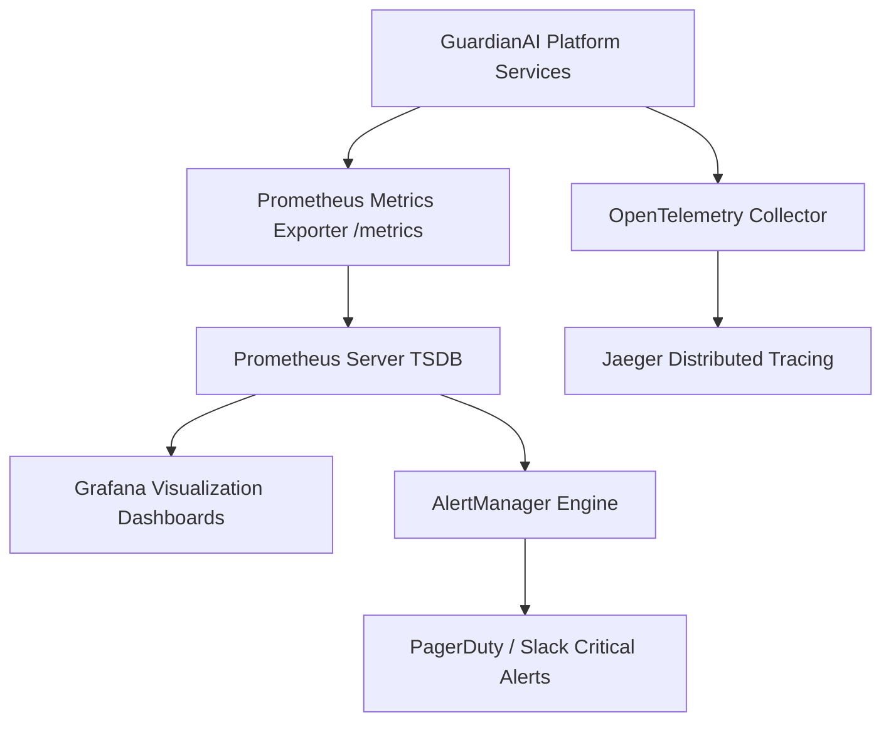

# GuardianAI Enterprise Monitoring & Observability Architecture

**Document Version:** 1.0.0  
**Date:** August 01, 2026  
**Status:** PRODUCTION OBSERVABILITY SPECIFICATION  
**Author:** Principal Cloud & Observability Architect  

---

## Executive Summary

The **GuardianAI Enterprise Monitoring Architecture** implements a 3-pillar observability stack:
1. **Metrics:** Prometheus + Grafana dashboards tracking RED (Rate, Errors, Duration) and USE (Utilization, Saturation, Errors).
2. **Logs:** Structured JSON logging exported to Grafana Loki / Elasticsearch.
3. **Traces:** Distributed tracing via OpenTelemetry & Jaeger across multi-stage scanning pipelines.

---

## 1. Observability Topology

---

## 2. Metric Subsystem Monitoring Catalog

| Subsystem Component | Key Prometheus Metric | Metric Type | SLA Target |
| :--- | :--- | :--- | :--- |
| **API Gateway** | `guardianai_http_requests_total` | Counter | 99.99% Availability |
| **API Latency** | `guardianai_http_request_duration_seconds` | Histogram | p95 $< 280\text{ ms}$, p99 $< 450\text{ ms}$ |
| **AI Reasoning Engine** | `guardianai_llm_tokens_total` | Counter | Metered token usage |
| **OCR Document Engine**| `guardianai_ocr_processing_seconds` | Histogram | $< 500\text{ ms}$ / page |
| **Voice Deepfake STT** | `guardianai_voice_stt_seconds` | Histogram | $< 600\text{ ms}$ / audio clip |
| **PostgreSQL Database**| `pg_stat_database_xact_commit` | Counter | Active Pool $< 80\%$ |
| **Redis Cache** | `guardianai_redis_cache_hits_total` | Counter | Cache Hit Ratio $> 90\%$ |
| **Browser Extension** | `guardianai_extension_heartbeats_total` | Counter | 100% active heartbeat |

---

## 3. Critical Alert Threshold Matrix

- **High Error Rate:** HTTP 5xx error rate $> 1.0\%$ for 5 minutes $\rightarrow$ PagerDuty P1 Alert.
- **API Latency Spike:** p95 latency $> 500\text{ ms}$ for 5 minutes $\rightarrow$ Slack P2 Alert.
- **Database Pool Exhaustion:** Active PostgreSQL connections $> 85\%$ for 2 minutes $\rightarrow$ PagerDuty P1 Alert.
