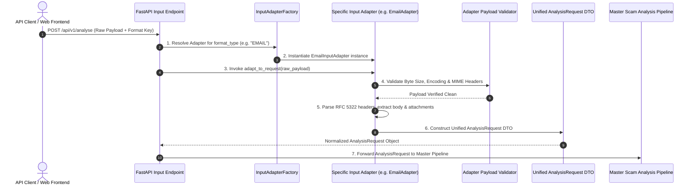

# GuardianAI Multi-Format Input Adapter Layer Architecture Specification

**Document Version:** 1.0.0  
**Architect:** Principal Software Architect  
**Target Subsystem:** Input Adapter & Polymorphic Normalization Layer (`app/adapters/`)  
**Date:** July 2026  
**Status:** **APPROVED ARCHITECTURAL SPECIFICATION**  

---

## 1. Executive Summary & Core Mission

The **GuardianAI Input Adapter Layer** provides a unified, polymorphic data normalization interface. Its primary mission is to accept heterogeneous input payload types—ranging from raw SMS plain text, web URLs, RFC 5322 emails, uploaded PDF documents, image screenshots, and decoded QR codes to future voice recordings, browser extension events, and chat exports—and convert them into a single, standardized `AnalysisRequest` DTO object consumed by the Master Scam Analysis Pipeline.

---

## 2. System Architecture & Adapter Sequence Flow



---

## 3. Modular Folder Structure Layout (`backend/app/adapters/`)

```
backend/app/adapters/
├── __init__.py                # Package exports & Factory registry
├── base.py                    # Abstract BaseInputAdapter interface
├── factory.py                 # InputAdapterFactory & MIME type sniffer
├── schemas.py                 # Common AnalysisRequest & AdapterMetadata DTOs
├── text_adapter.py            # Plain Text Input Adapter
├── url_adapter.py             # Web URL Input Adapter
├── email_adapter.py           # RFC 5322 Email Input Adapter
├── pdf_adapter.py             # Uploaded PDF Document Adapter
├── image_adapter.py           # Image Screenshot Adapter (Placeholder for OCR)
├── qr_adapter.py              # QR Code Image Payload Adapter
└── future/                    # Future Input Modality Adapters
    ├── voice_adapter.py       # Future Voice Recording & Deepfake Adapter
    ├── browser_adapter.py     # Future Chrome Extension DOM Event Adapter
    ├── whatsapp_adapter.py    # Future WhatsApp Chat Export Adapter
    ├── telegram_adapter.py    # Future Telegram Export Adapter
    ├── json_adapter.py        # Future JSON API Batch Adapter
    └── csv_adapter.py         # Future Bulk CSV Upload Adapter
```

---

## 4. Software Design Patterns

### A. The Adapter Pattern (`BaseInputAdapter`)
All format adapters derive from `BaseInputAdapter` and implement the asynchronous `adapt_to_request()` method:

```python
from abc import ABC, abstractmethod
from typing import Any
from app.adapters.schemas import AnalysisRequest

class BaseInputAdapter(ABC):
    """Abstract Base Class for all Polymorphic Input Adapters."""

    @abstractmethod
    async def adapt_to_request(self, raw_payload: Any, **kwargs: Any) -> AnalysisRequest:
        """Converts raw heterogeneous input payload into a standardized AnalysisRequest DTO."""
        pass
```

### B. The Factory Pattern (`InputAdapterFactory`)
`InputAdapterFactory` maps format strings (`TEXT`, `URL`, `EMAIL`, `PDF`, `IMAGE`, `QR`) and MIME types (`application/pdf`, `image/png`) to registered adapter classes:

```python
class InputAdapterFactory:
    """Factory resolving appropriate InputAdapter by format key or MIME type."""

    _adapter_registry: Dict[str, Type[BaseInputAdapter]] = {}

    @classmethod
    def register(cls, format_type: str, adapter_cls: Type[BaseInputAdapter]) -> None:
        cls._adapter_registry[format_type.upper()] = adapter_cls

    @classmethod
    def get_adapter(cls, format_type: str) -> BaseInputAdapter:
        fmt = format_type.upper()
        if fmt not in cls._adapter_registry:
            raise KeyError(f"No registered adapter for format '{format_type}'")
        return cls._adapter_registry[fmt]()
```

---

## 5. Unified `AnalysisRequest` Object DTO Schema

Regardless of original input format, every adapter produces this exact normalized DTO:

```python
class AdapterMetadata(BaseModel):
    original_format: str
    mime_type: Optional[str] = None
    file_size_bytes: int = 0
    sender_info: Optional[str] = None
    extracted_urls_count: int = 0

class AnalysisRequest(BaseModel):
    request_id: str
    scan_id: str
    input_format: str = Field(description="TEXT, URL, EMAIL, IMAGE, PDF, QR, VOICE, BROWSER")
    raw_text: str = Field(description="Extracted clean text ready for NLP & Threat Engines")
    language: str = "en"
    target_persona: str = "SENIOR_CITIZENS"
    metadata: AdapterMetadata
```

---

## 6. Error Handling & Validation Strategy

1. **Validation Layer:** Enforces byte size limits (10MB max), UTF-8 encoding integrity, extension whitelist (`.txt`, `.pdf`, `.png`, `.jpg`), and null byte (`\x00`) rejection.
2. **Custom Exception Hierarchy:** Raises structured `InputAdapterError` (HTTP 422 Unprocessable Entity) with details on exact byte offsets or malformed syntax.
3. **Graceful Fallback:** If PDF or Image text extraction fails, the adapter extracts metadata (filename, author, byte size) to allow partial threat inspection.

---

## 7. Future Extensibility Roadmap

Adding support for a new input modality (e.g. **WhatsApp Export** or **Voice Recording**) requires only two steps:
1. Create a new subclass `WhatsAppInputAdapter(BaseInputAdapter)` in `app/adapters/future/whatsapp_adapter.py`.
2. Call `InputAdapterFactory.register("WHATSAPP_EXPORT", WhatsAppInputAdapter)`.

No existing pipeline or decision engine code needs modification!
