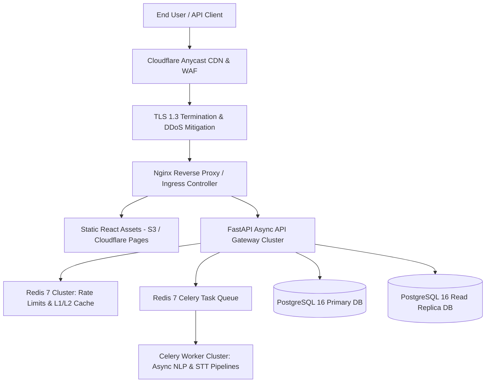

# GuardianAI Enterprise Production Cloud Architecture Specification

**Document Version:** 1.0.0  
**Date:** August 01, 2026  
**Status:** ARCHITECTURAL SPECIFICATION & INFRASTRUCTURE DESIGN  
**Author:** Principal Cloud Architect  

---

## Executive Summary

The **GuardianAI Enterprise Production Infrastructure** is designed for **99.99% Availability**, **sub-100ms API SLA**, and **elastic horizontal scaling** across multi-zone Kubernetes / Cloud clusters. 

The architecture decouples the high-performance **React SPA Frontend** (served via Cloudflare Edge CDN), the **FastAPI Async Gateway Engine** (autoscale 3–50 pods), **PostgreSQL 16 Multi-AZ** (Primary + Read Replicas), and **Redis 7 Cluster** (Rate Limiting & L2 Caching).

---

## 1. System Architecture Topology



---

## 2. Deployment & Network Topology

```mermaid
graph LR
    subgraph Public Subnet (DMZ)
        Ingress[Nginx Ingress / ALB]
    end
    
    subgraph Private Application Subnet
        API1[FastAPI App Pod 1]
        API2[FastAPI App Pod 2]
        Worker1[Celery Worker Pod 1]
    end
    
    subgraph Data Layer Subnet (Isolated)
        Redis[(Redis 7 Cluster)]
        PGPrimary[(Postgres 16 Primary)]
        PGReplica[(Postgres 16 Read Replica)]
    end
    
    Ingress --> API1
    Ingress --> API2
    API1 --> Redis
    API2 --> Redis
    API1 --> PGPrimary
    API2 --> PGReplica
    API1 --> Worker1
```

---

## 3. Infrastructure Monorepo Folder Structure

```
GuardianAI/
├── .github/
│   └── workflows/
│       ├── ci-cd.yml               # Production GitHub Actions Pipeline
│       └── security-scan.yml
├── backend/
│   ├── app/                        # FastAPI Enterprise Modular Core
│   ├── Dockerfile.backend          # Production Multi-Stage Dockerfile
│   └── requirements.txt
├── frontend/
│   ├── src/                        # React SPA Console
│   ├── Dockerfile.frontend         # Nginx Multi-Stage Dockerfile
│   └── nginx.conf                  # Edge Nginx Routing Config
├── docker-compose.yml              # Local Development Stack
├── docker-compose.prod.yml         # Production Container Orchestration
├── kubernetes/                     # Production K8s Manifests
│   ├── deployment-api.yaml
│   ├── deployment-worker.yaml
│   ├── hpa.yaml                    # Horizontal Pod Autoscaler
│   └── ingress.yaml
└── docs/
    └── PRODUCTION_CLOUD_ARCHITECTURE.md
```

---

## 4. Environment Separation Strategy

| Environment | Database Engine | Redis Cache | Scaling Model | SSL / TLS | Domain |
| :--- | :--- | :--- | :--- | :--- | :--- |
| **Development** | SQLite (`guardian_ai.db`) | In-Memory MemoryStore | 1 Uvicorn Process | Self-Signed / HTTP | `localhost:5173` |
| **Staging** | PostgreSQL 16 (Single AZ) | Redis 7 Standalone | 2 Replicas | Let's Encrypt TLS 1.3 | `staging-api.guardianai.io` |
| **Production** | PostgreSQL 16 Multi-AZ | Redis 7 Cluster (HA) | HPA 3 to 50 Pods | Cloudflare Managed TLS 1.3 | `api.guardianai.io` |

---

## 5. Production Best Practices & Security Hardening

1. **Zero Downtime Deployments:** Kubernetes RollingUpdate strategy (`maxSurge: 25%`, `maxUnavailable: 0`).
2. **Secrets Management:** Environment variables injected dynamically from AWS Secrets Manager / HashiCorp Vault.
3. **Health Check Probes:** Liveness probe (`GET /api/v1/health/liveness`) and Readiness probe (`GET /api/v1/health/readiness`).
4. **Non-Root Container Execution:** Dockerfiles run as unprivileged `appuser` (UID 10001).

---

## 6. Scalability & Disaster Recovery Strategy

- **RPO (Recovery Point Objective):** $< 15$ minutes (Automated 15-min WAL archiving to S3 Glacier).
- **RTO (Recovery Time Objective):** $< 1$ hour (Automated Infrastructure-as-Code Terraform recovery).
- **Multi-Region Failover:** Route53 DNS Failover switching traffic to secondary DR region upon health probe failure.
