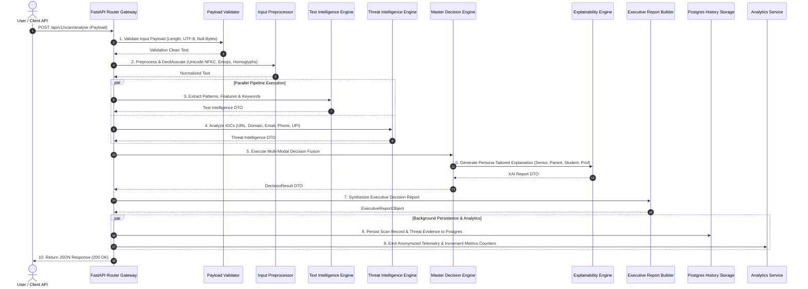

# GuardianAI Master Scam Analysis Pipeline Architecture Specification

**Document Version:** 1.0.0  
**Architect:** Principal AI Architect  
**Target Subsystem:** Master Scam Analysis Pipeline Orchestrator (`app/pipeline/`)  
**Date:** July 2026  
**Status:** **APPROVED ARCHITECTURAL SPECIFICATION**  

---

## 1. Executive Summary & Core Mission

The **GuardianAI Master Scam Analysis Pipeline** is the top-level end-to-end orchestrator of the GuardianAI platform. It coordinates payload validation, text preprocessing, multi-vector threat intelligence, Gemini LLM evaluation, decision fusion, persona-tailored XAI explainability, executive report generation, database history persistence, and telemetry analytics into a fault-tolerant, high-throughput pipeline.

---

## 2. System Architecture & End-to-End Sequence Flow



---

## 3. Modular Folder Structure Layout (`backend/app/pipeline/`)

```
backend/app/pipeline/
├── __init__.py                # Package exports
├── orchestrator.py            # Master Scam Analysis Pipeline Orchestrator
├── validator.py               # Input validation & sanitization stage
├── preprocessor.py            # Text normalization & homoglyph stage
├── history_recorder.py        # Async Postgres database persistence stage
├── analytics_notifier.py      # Telemetry & analytics event emission stage
├── recovery.py                # Fault-tolerant fallback & error recovery handlers
└── extensions/                # Future Pipeline Extension Handlers
    ├── ocr_pipeline.py        # Future OCR Image Text Extraction Handler
    ├── voice_pipeline.py      # Future Speech & Voice Deepfake Handler
    ├── browser_pipeline.py    # Future Browser Extension Integration Handler
    ├── notification_handler.py# Future Push & SMS Notification Handler
    └── community_handler.py   # Future Crowdsourced Threat Database Handler
```

---

## 4. Fault-Tolerant Error Recovery & Retry Strategies

The pipeline incorporates a **Graceful Degradation Architecture**:

1. **Subsystem Isolation:** If Threat Intelligence lookup encounters an external API timeout, the pipeline falls back to offline heuristic rules (`domain_intel.py`, `url_intel.py`) without failing the overall scan.
2. **Gemini LLM Fallback:** If Gemini 3.6 Flash High model execution times out (> 10s), the Decision Engine relies on Rule-based Pattern & Technical IOC Threat Scores to compute the final scam probability.
3. **Exponential Backoff Retries:** Intermittent API errors trigger a 3-tier exponential backoff retry mechanism (100ms → 300ms → 900ms) managed by `AIService`.
4. **Database Resilience:** Database history persistence runs asynchronously in background tasks (`BackgroundTasks`), ensuring database connection hiccups never block HTTP user response delivery.

---

## 5. Future Extensibility Hooks Architecture

The extensions directory (`app/pipeline/extensions/`) exposes modular pipeline hook interfaces (`BasePipelineExtension`):

```python
class BasePipelineExtension:
    async def pre_process_stage(self, payload: Any) -> Any:
        """Hook executed prior to main intelligence analysis."""
        pass

    async def post_process_stage(self, result: Any) -> Any:
        """Hook executed following master decision fusion."""
        pass
```

### Supported Future Extensions:
- **OCR Extension:** Processes uploaded screenshot images using Tesseract / Google Vision OCR before passing text into the pipeline.
- **Voice Analysis Extension:** Converts audio voice notes into text transcripts while computing acoustic synthetic deepfake risk scores.
- **Browser Extension Hook:** Receives real-time DOM mutation events and form target URLs from the GuardianAI Chrome Extension.
- **Push Notifications:** Triggers immediate SMS / Push emergency alerts to family members when a CRITICAL threat is detected for a Senior Citizen user.
- **Community Reports Integration:** Queries global user-reported scam database to boost confidence on newly emerging zero-day scam vectors.
