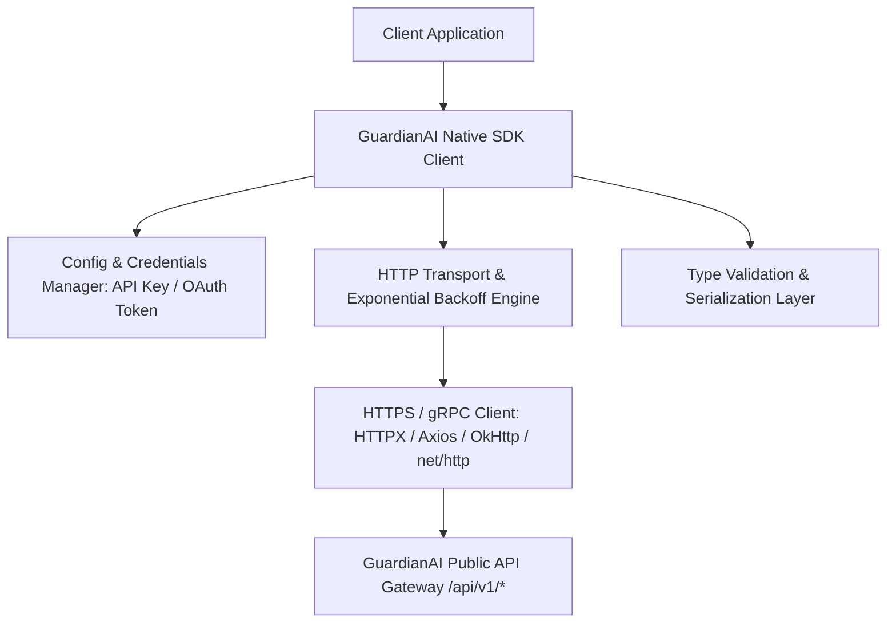

# GuardianAI Polyglot SDK Client Libraries Architecture Specification

**Document Version:** 1.0.0  
**Date:** August 01, 2026  
**Status:** ARCHITECTURAL SPECIFICATION & DESIGN  
**Author:** Principal API Platform Architect  

---

## Executive Summary

The **GuardianAI Polyglot SDK Client Libraries** provide native, type-safe, low-latency language bindings for **Python**, **JavaScript / TypeScript**, **Java**, and **Go**.

All SDKs feature automatic retries with exponential backoff, async/await non-blocking execution, API Key & OAuth2 authentication token renewal, Pydantic/Zod/Native type validation, and streaming WebSocket capabilities.

---

## 1. SDK Client Architecture & Layer Topology



---

## 2. Target SDK Monorepo Directory Structure

```
sdks/
├── python/                     # guardianai-sdk (PyPI)
│   ├── guardianai/
│   │   ├── __init__.py
│   │   ├── client.py           # Synchronous & Async Client
│   │   ├── exceptions.py
│   │   └── models.py
│   ├── pyproject.toml
│   └── tests/
├── typescript/                 # @guardianai/sdk (npm)
│   ├── src/
│   │   ├── index.ts
│   │   ├── client.ts
│   │   └── types.ts
│   └── package.json
├── go/                         # github.com/guardianai/sdk-go
│   ├── client.go
│   ├── models.go
│   └── go.mod
└── java/                       # com.guardianai:sdk-java (Maven / Gradle)
    ├── src/main/java/com/guardianai/GuardianAIClient.java
    └── build.gradle
```

---

## 3. OpenAPI Code Generation Strategy

To ensure zero divergence between backend OpenAPI REST definitions and SDK client libraries:
- **Single Source of Truth:** `http://localhost:8000/api/v1/openapi.json`.
- **OpenAPI Generator Tooling:** Automated CI/CD pipeline executing `openapi-generator-cli` on every release build.

---

## 4. Code Examples Across Polyglot Languages

### Python SDK (`pip install guardianai-sdk`):
```python
from guardianai import GuardianAIClient

client = GuardianAIClient(api_key="gai_live_88f92a110099xza21_prod")
result = client.scan_url("http://hdfc-verify.top")
print(f"Risk Score: {result.threat_score}, Recommended Action: {result.recommended_action}")
```

### TypeScript / Node.js SDK (`npm install @guardianai/sdk`):
```typescript
import { GuardianAIClient } from '@guardianai/sdk';

const client = new GuardianAIClient({ apiKey: 'gai_live_88f92a110099xza21_prod' });
const result = await client.scanUrl('http://hdfc-verify.top');
console.log(`Threat Score: ${result.threat_score}`);
```

### Go SDK (`go get github.com/guardianai/sdk-go`):
```go
package main

import (
    "fmt"
    "github.com/guardianai/sdk-go"
)

func main() {
    client := guardianai.NewClient("gai_live_88f92a110099xza21_prod")
    result, _ := client.ScanURL("http://hdfc-verify.top")
    fmt.Printf("Risk Score: %d\n", result.ThreatScore)
}
```

### Java SDK (`implementation "com.guardianai:sdk-java:1.0"`):
```java
import com.guardianai.GuardianAIClient;
import com.guardianai.models.ScanResult;

GuardianAIClient client = new GuardianAIClient("gai_live_88f92a110099xza21_prod");
ScanResult result = client.scanUrl("http://hdfc-verify.top");
System.out.println("Threat Score: " + result.getThreatScore());
```
