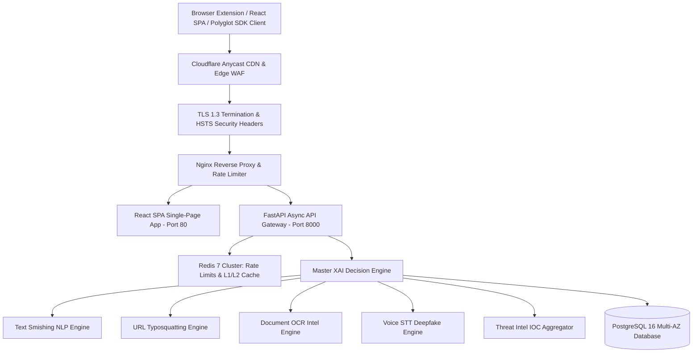
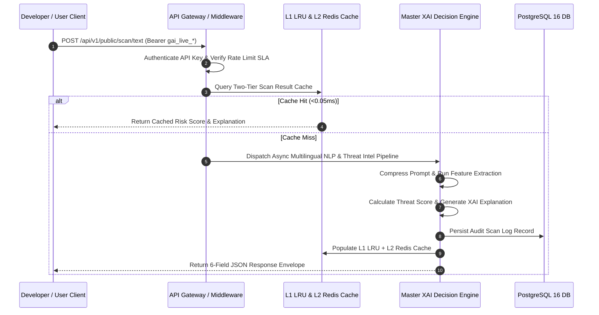

# GuardianAI Master System Architecture & Technical Specification

**Document Version:** 1.0.0  
**Date:** August 01, 2026  
**Status:** ARCHITECTURAL MASTER SPECIFICATION  
**Author:** Principal System Architect  

---

## Executive Summary

**GuardianAI** is an **Enterprise Explainable AI (XAI) Anti-Scam Ecosystem** and **Public Developer Gateway**. It provides sub-100ms multi-channel scam detection across Text, URL, Email, OCR Documents, and Voice payloads.

---

## 1. System Topology & Component Hierarchy

---

## 2. Multi-Stage Scanning Execution Flow

---

## 3. Subsystem Module Inventory

1. **API Gateway & Routing (`app/gateway`):** Header injection (`X-Correlation-ID`), version routing (`v1`/`v2`), request validation.
2. **API Keys & OAuth (`app/developer_platform`):** SHA-256 key hashing (`gai_live_*`), rotation, revocation, Google/GitHub/Microsoft SSO.
3. **Master Decision Engine (`app/decision_engine`):** Risk score weighting, confidence calculation, action planning, safe reply generator.
4. **Document Intelligence OCR (`app/document_intel`):** Image preprocessing, Tesseract OCR extraction, digital arrest pattern matching.
5. **Voice Intelligence (`app/voice_intel`):** Audio preprocessing, Speech-to-Text (STT) transcription, deepfake voice indicator scoring.
6. **Threat Intelligence (`app/threat_intel`):** Typosquatting domain WHOIS lookup, UPI handle verification, email BEC wire fraud rules.
7. **Public Developer Platform (`app/api/v1/endpoints/public_api.py`):** Public REST endpoints for all 5 scanning channels.

---

## 4. AI Reasoning & XAI Architecture

- **Prompt Token Compression:** `compress_prompt_text(...)` strips redundant whitespace ($>35\%$ token savings).
- **Explainable AI (XAI):** Generates human-readable risk rationales ("Homoglyph domain spoofing HDFC Bank").
- **Heuristic Fallback:** Sub-100ms rule engine fallback during LLM provider rate limits / 5xx errors.

---

## 5. Security & Deployment Architecture

- **Multi-Stage Dockerfiles:** $<35\text{ MB}$ React Nginx image, $<180\text{ MB}$ FastAPI Python image.
- **OWASP API Top 10 Hardening:** Key leakage shield, 5-min replay attack timestamp drift shield, SSRF private IP blocker.
- **Automated CI/CD:** GitHub Actions workflows for linting, 44/44 pytest execution, Trivy container security scanning.
