# GuardianAI: Master UI/UX Design & Wireframe Specification

**Document Title:** Master UI/UX Wireframe & Accessibility Design Specification for GuardianAI  
**Document Version:** 1.0.0  
**Status:** Approved for Frontend Engineering  
**Authors:** Leadership Team (Principal Software Architect, Principal AI Engineer, Principal Cybersecurity Engineer, Senior Product Manager, Senior UX Designer)  
**Target Guidelines:** WCAG 2.1 Level AA, Accessible Non-Alarmist UX, Senior Citizen Friendly  

---

## Executive Summary & Design System Principles

GuardianAI's user experience is built around **Calm Security, Transparent Explainability, and Universal Accessibility**. Security interfaces often induce panic through aggressive red alert banners and cryptic technical jargon. GuardianAI flips this paradigm by providing clear, color-coded threat signals (Green/Yellow/Red), plain-language summaries, visual text attributions, and a dedicated **Senior Citizen Mode**.

---

## 1. Universal Layout Structure & Top Navigation

All authenticated screens share a responsive, accessible application shell featuring a top navigation bar with instant access to the **Senior Mode Toggle** and quick scanning tools.

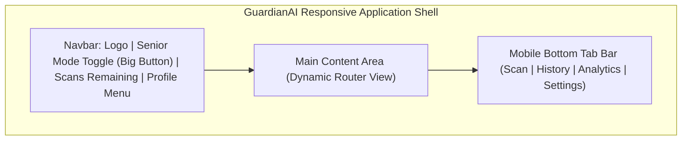

---

## 2. Screen Wireframes & UX Rationales

### 2.1 Screen 1: Landing Page (`/`)

* **Purpose:** Introduces GuardianAI, provides instant 1-click scan capabilities without requiring immediate sign-up, and demonstrates XAI visual highlights.

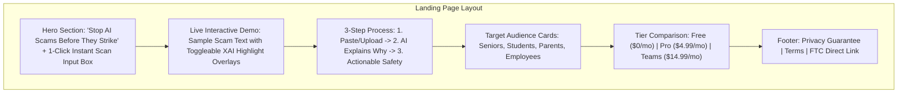

* **UX Rationale:** 
  * Providing an immediate scan input directly on the hero section reduces conversion friction.
  * The Senior Mode quick-toggle switch is prominently displayed at the top right of the hero banner.

---

### 2.2 Screen 2: Main Dashboard (`/dashboard`)

* **Purpose:** Primary command hub for authenticated users, showing personal safety score, scan quota, and quick scanner tabs.

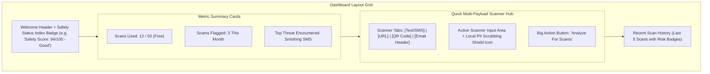

* **UX Rationale:**
  * Displays a consolidated "Safety Index" badge giving users positive reinforcement for scanning messages.
  * Multi-payload tabs allow switching between Text, URL, QR, and Email without page reloads.

---

### 2.3 Screen 3: Scan Message Screen (`/scan/text`)

* **Purpose:** Specialized interface for analyzing raw text and SMS messages.

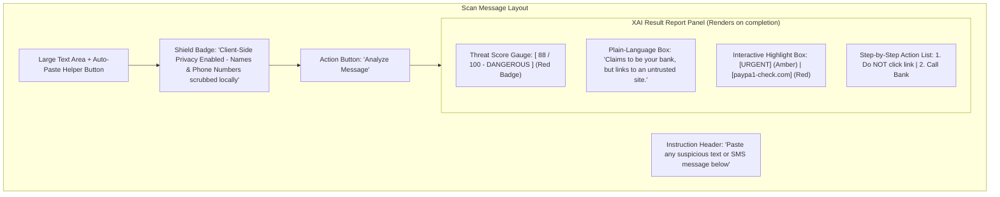

* **UX Rationale:**
  * Auto-paste helper button reduces friction on mobile devices.
  * Visual highlights allow users to click individual flagged words to read specific threat reasons.

---

### 2.4 Screen 4: Scan Email Screen (`/scan/email`)

* **Purpose:** Parses `.eml` raw email files or pasted email headers to detect Business Email Compromise (BEC) and domain spoofing.

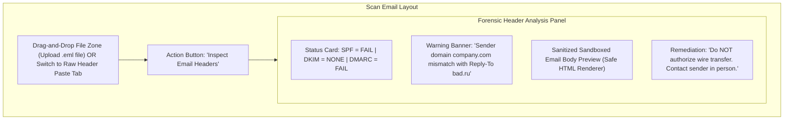

* **UX Rationale:**
  * Clearly separates authentication technical matrices (SPF/DKIM) from practical human advice.
  * Email body rendering is sandboxed inside an isolated iframe to prevent script execution.

---

### 2.5 Screen 5: Scan URL Screen (`/scan/url`)

* **Purpose:** Evaluates target web links for WHOIS age, typosquatting, and homoglyphs.

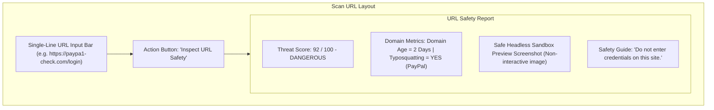

* **UX Rationale:**
  * Shows a static screenshot of the destination page taken in a cloud sandbox so users can visually recognize spoofed login portals without opening the link themselves.

---

### 2.6 Screen 6: Scan QR Screen (`/scan/qr`)

* **Purpose:** Decodes QR codes from flyer pictures or live camera feeds.

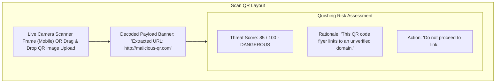

* **UX Rationale:**
  * Does NOT automatically open the decoded URL in the browser, preventing drive-by downloads.

---

### 2.7 Screen 7: Scan History Screen (`/history`)

* **Purpose:** Allows users to search, filter, and review past scan results.

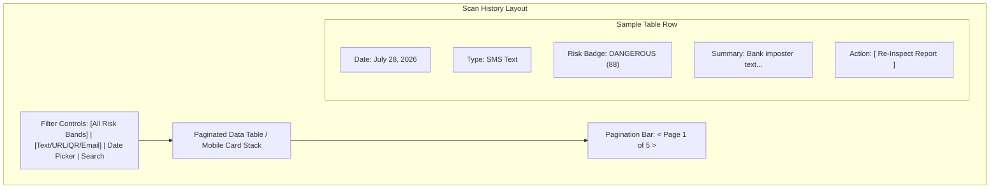

* **UX Rationale:**
  * Uses clear color-coded pill badges for quick visual scanning of historical threats.

---

### 2.8 Screen 8: Reports & Fraud Dispatch Screen (`/reports`)

* **Purpose:** Formats anonymized threat payloads and submits official reports to public anti-fraud agencies.

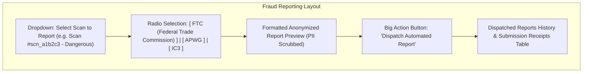

* **UX Rationale:**
  * Shows users a live preview of the scrubbed data *before* sending, reinforcing privacy trust.

---

### 2.9 Screen 9: Analytics Screen (`/analytics`)

* **Purpose:** Visualizes personal or organization threat metrics over time.

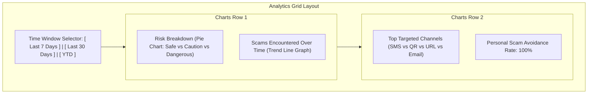

---

### 2.10 Screen 10: Profile Screen (`/profile`)

* **Purpose:** Manages account information, subscription tier, and active security sessions.

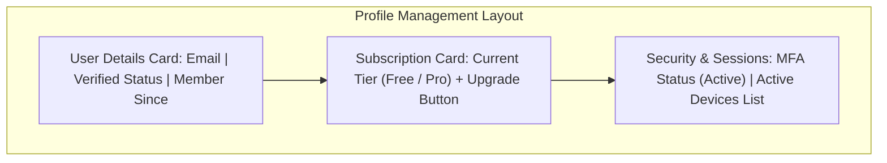

---

### 2.11 Screen 11: Settings Screen (`/settings`)

* **Purpose:** Controls accessibility modes, privacy options, and developer API keys.

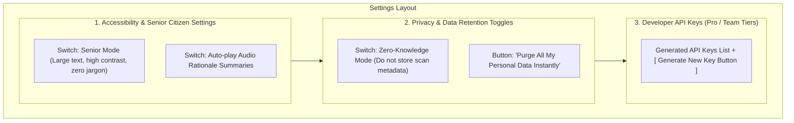

* **UX Rationale:**
  * Senior Mode toggle is given top billing on the settings page for immediate accessibility configuration.

---

### 2.12 Screen 12: Error Pages (`404`, `500`, `Offline`)

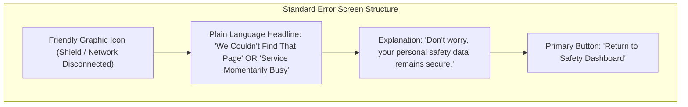

---

### 2.13 Screen 13: Loading States (Skeleton UI & Progress Indicators)

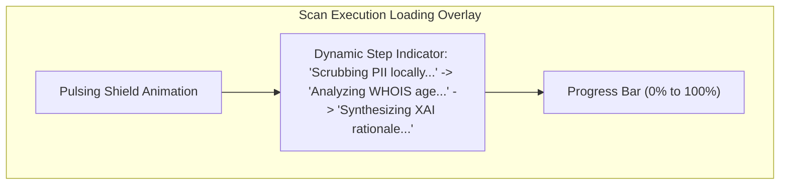

* **UX Rationale:**
  * Informative dynamic step text manages user expectations and educates them on the deep checks being performed during the sub-1.8s wait.

---

### 2.14 Screen 14: Empty States (`No History`, `No Scans`)

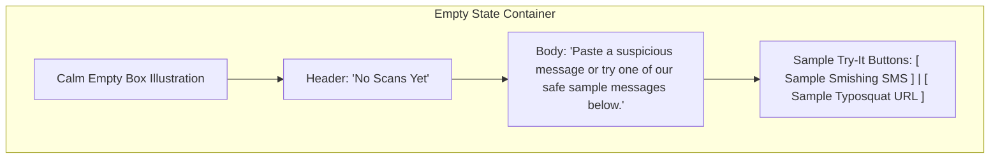

* **UX Rationale:**
  * Includes 1-click sample buttons so new users can test GuardianAI's XAI features immediately without needing a real scam message.

---

### 2.15 Screen 15: Success Pages (`Report Dispatched`, `Key Generated`)

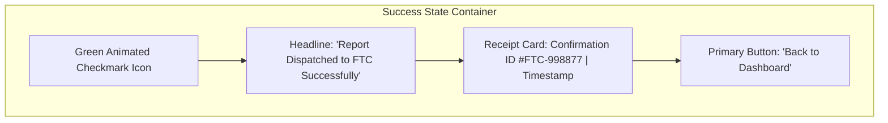

---

## 3. Usability & Accessibility Audit

The cross-functional UI/UX leadership team audited the screen wireframes against core accessibility standards:

1. **Senior Citizen Accessibility (WCAG 2.1 AA):**  
   * **Senior Mode** activates $18\text{px}+$ typography, $7:1$ contrast ratios, converts complex technical graphs into plain-language status cards, and turns on Web Speech audio narrations.
2. **Colorblind Friendliness:**  
   * All risk badges rely on **Icon + Text Label + Color** (e.g., `[!] DANGEROUS (Red)` vs `[v] SAFE (Green)`), ensuring users with color vision deficiencies can distinguish risk bands easily.
3. **Non-Alarmist UX:**  
   * Red alerts provide instant, reassuring remediation checklists ("What you should do next") rather than inciting fear.

---
*End of Master UI/UX Design & Wireframe Specification.*
