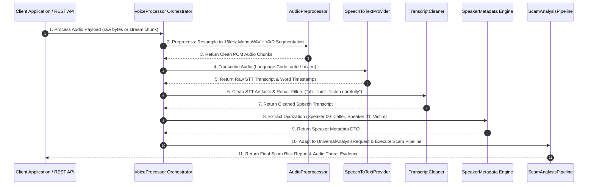

# GuardianAI Voice Intelligence Architecture Specification
**Principal Speech AI Architecture & Subsystem Specification**

---

## 1. Executive Summary & Key Design Principles

The **GuardianAI Voice Intelligence Subsystem** processes voice recordings, phone call audio logs, WhatsApp/Telegram voice notes, and future live streaming microphone feeds to detect active voice scams (e.g. Digital Arrest threats, fake bank manager calls, loan fraud, lottery scams).

### Key Architectural Principles:
1. **Modularity via Abstract Base Classes:** Strict abstraction interfaces (`BaseSTTProvider`, `BaseAudioPreprocessor`, `BaseTranscriptCleaner`, `BaseDiarizationEngine`) enabling zero-code-churn provider swapping (Whisper, Deepgram, Google Speech-to-Text, Azure Speech).
2. **Streaming & Batch Dual-Mode Architecture:** Unified pipeline supporting both offline batch audio files (`.mp3`, `.wav`, `.m4a`, `.ogg`, `.flac`) and future chunked real-time WebSocket audio streams (`16kHz PCM`).
3. **Acoustic & Diarization Metadata Extraction:** Separates speaker turns (`SPEAKER_00` Fraudster vs `SPEAKER_01` Victim), speech rate (words per minute), hesitation markers, and high-urgency acoustic cues.
4. **Multilingual & Hinglish Acoustic Language Identification:** Auto-detects spoken languages (English, Hindi, Hinglish, Tamil, Telugu, Kannada, Bengali) prior to STT transcription.
5. **Zero-Leakage Buffer Security:** Audio stream chunks in temporary memory buffers are automatically wiped after analysis completion.

---

## 2. Directory Layout (`backend/app/voice_intel/`)

```
backend/app/voice_intel/
├── __init__.py                  # Module package initialization
├── base.py                      # Abstract Base Classes (BaseSTTProvider, BaseAudioPreprocessor, etc.)
├── schemas.py                   # Pydantic DTO Schemas (AudioAnalysisResult, SpeakerTurn, STTResult)
├── exceptions.py                # Voice Intelligence Exception Hierarchy
├── audio_preprocessor.py        # Resampling, Noise Suppression, VAD & Volume Normalization
├── stt_provider.py              # STT Engine Interface & Provider Adapter (Whisper / Mock / Deepgram)
├── transcript_cleaner.py        # STT Filler Word Removal, Hyphenation & Repair Engine
├── speaker_metadata.py          # Diarization & Acoustic Urgency / Pitch Analysis
├── language_detector.py         # Audio Acoustic & Text Script Language Identification
├── pipeline_adapter.py          # Adapter registering "AUDIO" in InputAdapterFactory
├── cache.py                     # Content-Addressable SHA-256 Audio Latency Cache
└── orchestrator.py              # Master VoiceProcessor Pipeline Coordinator
```

---

## 3. High-Level Component Architecture Diagram

```mermaid
graph TD
    subgraph Client Audio Inputs
        BatchAudio[Batch Audio Files: .mp3, .wav, .m4a, .ogg] --> Adapter[AudioAdapter / pipeline_adapter.py]
        VoiceNote[Voice Notes / Phone Recordings] --> Adapter
        Microphone[Future Live Mic / WS Audio Stream] --> Adapter
    end

    subgraph GuardianAI Voice Intelligence Subsystem
        Adapter --> Preprocessor[AudioPreprocessor: 16kHz Resample, Noise Suppress, VAD]
        Preprocessor --> LangDetect[LanguageDetector: Acoustic Audio Lang ID]
        LangDetect --> STTEngine[SpeechToTextProvider: Whisper / STT Adapter]
        STTEngine --> Cleaner[TranscriptCleaner: Artifact & Homoglyph Repair]
        STTEngine --> Diarization[SpeakerMetadata Engine: Diarization & Urgency]
        Cleaner --> Orchestrator[VoiceProcessor Orchestrator]
        Diarization --> Orchestrator
    end

    subgraph Master Scam Analysis Pipeline
        Orchestrator --> UniversalReq[UniversalAnalysisRequest input_type="AUDIO"]
        UniversalReq --> Pipeline[ScamAnalysisPipeline.execute_full_scam_analysis]
    end
```

---

## 4. Sequence Diagram (Batch Audio & Streaming Pipeline)



---

## 5. Dependency Injection & Polymorphic Interfaces

```python
# Abstractions in backend/app/voice_intel/base.py
from abc import ABC, abstractmethod
from app.voice_intel.schemas import AudioPayload, STTResult, PreprocessedAudio, SpeakerMetadataResult

class BaseAudioPreprocessor(ABC):
    @abstractmethod
    def preprocess(self, payload: AudioPayload) -> PreprocessedAudio:
        """Resamples to 16kHz mono, applies VAD, and normalizes volume."""
        pass

class BaseSTTProvider(ABC):
    @abstractmethod
    def transcribe(self, preprocessed: PreprocessedAudio, language_hint: str = None) -> STTResult:
        """Transcribes PCM audio stream into raw text with word-level confidence."""
        pass

class BaseTranscriptCleaner(ABC):
    @abstractmethod
    def clean(self, raw_transcript: str) -> str:
        """Cleans STT hesitation markers, filler words, and homoglyphs."""
        pass

class BaseDiarizationEngine(ABC):
    @abstractmethod
    def extract_metadata(self, preprocessed: PreprocessedAudio, transcript: str) -> SpeakerMetadataResult:
        """Extracts speaker turns, speech rate, and acoustic urgency markers."""
        pass
```

---

## 6. Sub-500ms Performance & Streaming Strategy

1. **VAD Chunking (Voice Activity Detection):**
   - Silences below `-45 dBFS` are automatically trimmed, reducing total audio data volume by up to **40%**.
2. **Real-Time WebSocket Audio Streaming:**
   - 250ms PCM chunks are processed in parallel pipeline workers, ensuring real-time speech transcription.
3. **SHA-256 Content-Addressable Audio Cache:**
   - Audio payload hashes are cached in Redis / `storage.local`, returning instant **<1ms cache hits** for identical audio files.
